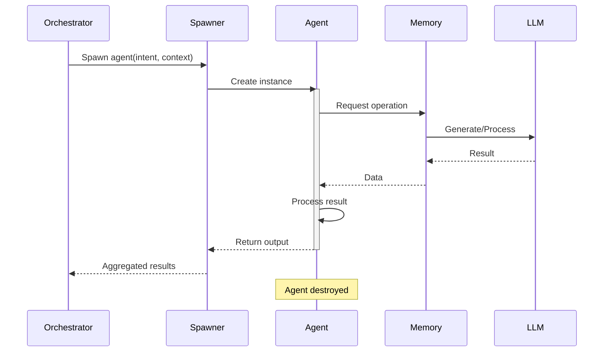
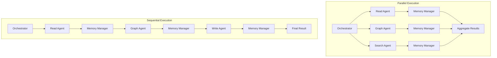
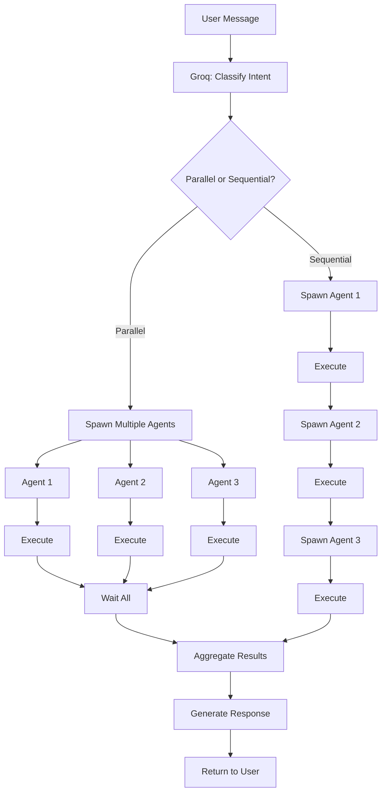

# Agent System Documentation

## Overview

The NeuroGraph agent system provides specialized, stateless agents that handle specific aspects of memory operations and knowledge management. Agents are spawned dynamically by the orchestrator in response to chat interface queries. MCP tools and webhooks bypass the agent system entirely for direct memory access.

## Design Principles

### 1. Stateless Architecture

All agents are stateless and ephemeral:
- No persistent state between invocations
- Context passed explicitly in each request
- Independent execution units
- Easy to scale horizontally

### 2. Specialized Responsibility

Each agent type handles a specific category of operations:
- Clear separation of concerns
- Optimized for specific tasks
- Reduced complexity per agent
- Easier testing and maintenance

### 3. Orchestration-Driven

Agents are spawned by the orchestrator based on classified intent:
- Only applies to chat interface
- MCP and webhooks use direct memory access
- Dynamic agent selection
- Parallel execution where possible

## Agent Types and Responsibilities

### Agent Type Matrix

| Agent Type | Primary Function | Key Operations | Typical Latency |
|-----------|------------------|----------------|-----------------|
| **Write Agent** | Store information | Create memories, extract entities | 200-500ms |
| **Read Agent** | Retrieve information | Recall, contextual search | 100-300ms |
| **Search Agent** | Discovery | Hybrid search, similarity queries | 150-400ms |
| **Graph Agent** | Relationship operations | Traversal, connection analysis | 100-300ms |
| **Integration Agent** | External data processing | Webhook processing, API calls | 200-600ms |

## Agent Lifecycle



### Lifecycle Stages

1. **Spawning**: Orchestrator creates agent with context
2. **Execution**: Agent performs specialized operations
3. **Processing**: Agent formats and validates results
4. **Completion**: Agent returns output and is destroyed
5. **Cleanup**: No state persists after execution

## Orchestration Logic

### Intent Classification

The Groq orchestrator classifies user intent and selects appropriate agents.

```python
# app/core/orchestrator.py
from typing import List, Dict, Any
import asyncio
from groq import AsyncGroq

class Intent:
    WRITE = "write"           # Store new information
    READ = "read"             # Retrieve specific information
    SEARCH = "search"         # Discover related information
    GRAPH = "graph"           # Analyze relationships
    MIXED = "mixed"           # Multiple operations required

class Orchestrator:
    def __init__(self, groq_api_key: str):
        self.client = AsyncGroq(api_key=groq_api_key)
        self.spawner = AgentSpawner()
    
    async def classify_intent(
        self, 
        message: str,
        conversation_history: List[Dict[str, str]]
    ) -> Dict[str, Any]:
        """
        Classify user intent using Groq LLM.
        """
        prompt = f"""Analyze the user message and classify the intent.
        
Message: {message}

Classify into one of:
- write: User wants to store/remember information
- read: User wants to retrieve specific information
- search: User wants to discover/explore information
- graph: User wants to analyze relationships/connections
- mixed: Multiple operations required

Respond with JSON:
{{
  "intent": "intent_name",
  "entities": ["entity1", "entity2"],
  "confidence": 0.95,
  "parallel_execution": true,
  "sub_tasks": [
    {{"agent": "read", "query": "..."}},
    {{"agent": "graph", "params": {{...}}}}
  ]
}}
"""
        
        response = await self.client.chat.completions.create(
            model="llama-3.3-70b-versatile",
            messages=[
                {"role": "system", "content": "You are an intent classifier."},
                {"role": "user", "content": prompt}
            ],
            response_format={"type": "json_object"}
        )
        
        return json.loads(response.choices[0].message.content)
    
    async def process_message(
        self,
        message: str,
        user_id: str,
        mode: str,
        organization_id: str = None,
        global_memory: bool = True,
        conversation_id: str = None,
    ) -> ProcessingResult:
        """
        Orchestrate agent execution based on classified intent.
        """
        # Classify intent
        classification = await self.classify_intent(
            message,
            conversation_history=[]  # Load from DB
        )
        
        # Spawn agents
        if classification["parallel_execution"]:
            # Execute agents in parallel
            tasks = [
                self.spawner.spawn_agent(
                    agent_type=task["agent"],
                    context={
                        "user_id": user_id,
                        "mode": mode,
                        "organization_id": organization_id,
                        "global_memory": global_memory,
                        **task.get("params", {})
                    }
                )
                for task in classification["sub_tasks"]
            ]
            results = await asyncio.gather(*tasks)
        else:
            # Execute agents sequentially
            results = []
            for task in classification["sub_tasks"]:
                result = await self.spawner.spawn_agent(
                    agent_type=task["agent"],
                    context={
                        "user_id": user_id,
                        "mode": mode,
                        "organization_id": organization_id,
                        "global_memory": global_memory,
                        **task.get("params", {})
                    }
                )
                results.append(result)
        
        # Aggregate results
        return self._aggregate_results(results, classification)
```

### Parallel vs Sequential Execution



**Parallel Execution Criteria**:
- Independent operations
- No data dependencies between agents
- Read-only operations
- Example: "Search for projects AND show me related people"

**Sequential Execution Criteria**:
- Dependent operations
- Output of one agent feeds into another
- Write operations that affect subsequent reads
- Example: "Remember this information AND then summarize everything about this topic"

## Individual Agent Deep-Dives

### Write Agent

Handles information storage and entity creation.

```python
# app/agents/write-agent.py
from app.agents.base-agent import BaseAgent
from app.core.memory-manager import MemoryManager

class WriteAgent(BaseAgent):
    """
    Agent responsible for storing information and creating entities.
    """
    
    async def execute(self, context: Dict[str, Any]) -> Dict[str, Any]:
        """
        Store information in the memory system.
        """
        content = context["content"]
        layer = self._determine_layer(context)
        
        # Store in memory
        memory_result = await self.memory.remember(
            content=content,
            layer=layer,
            user_id=context["user_id"],
            metadata=context.get("metadata", {})
        )
        
        # Extract entities if requested
        if context.get("extract_entities", True):
            entities = await self._extract_entities(content)
            relationships = await self._extract_relationships(content, entities)
            
            # Create graph nodes and edges
            for entity in entities:
                await self.memory.create_entity(
                    name=entity["name"],
                    entity_type=entity["type"],
                    properties=entity.get("properties", {}),
                    layer=layer
                )
            
            for rel in relationships:
                await self.memory.create_relationship(
                    source_id=rel["source"],
                    target_id=rel["target"],
                    rel_type=rel["type"],
                    properties=rel.get("properties", {})
                )
        
        return {
            "status": "success",
            "memory_id": memory_result["id"],
            "entities_created": len(entities),
            "relationships_created": len(relationships),
            "confidence": memory_result["confidence"]
        }
    
    def _determine_layer(self, context: Dict[str, Any]) -> str:
        """
        Determine the appropriate memory layer based on context.
        """
        if context.get("mode") == "general":
            return "personal"
        elif context.get("organization_id"):
            return "shared"
        return "personal"
    
    async def _extract_entities(self, content: str) -> List[Dict[str, Any]]:
        """
        Extract entities from content using LLM.
        """
        prompt = f"""Extract entities from the following text.
        
Text: {content}

Identify:
- People (names, roles)
- Projects (names, descriptions)
- Organizations (names)
- Events (names, dates)
- Documents (titles, types)
- Locations (places)

Return JSON array:
[
  {{"name": "Entity Name", "type": "person", "properties": {{}}}},
  ...
]
"""
        response = await self.llm.generate(prompt)
        return json.loads(response)
```

### Read Agent

Handles information retrieval and recall.

```python
# app/agents/read-agent.py
from app.agents.base-agent import BaseAgent

class ReadAgent(BaseAgent):
    """
    Agent responsible for retrieving stored information.
    """
    
    async def execute(self, context: Dict[str, Any]) -> Dict[str, Any]:
        """
        Retrieve information from memory based on query.
        """
        query = context["query"]
        layers = self._determine_layers(context)
        
        # Perform memory recall
        results = await self.memory.recall(
            query=query,
            layers=layers,
            max_results=context.get("max_results", 10),
            min_confidence=context.get("min_confidence", 0.5),
            temporal_weight=context.get("temporal_weight", 0.2)
        )
        
        # Enhance with graph context
        enhanced_results = []
        for result in results:
            graph_context = await self._get_graph_context(
                result["entities"]
            )
            enhanced_results.append({
                **result,
                "graph_context": graph_context
            })
        
        return {
            "status": "success",
            "results": enhanced_results,
            "total_found": len(results),
            "layers_searched": layers
        }
    
    def _determine_layers(self, context: Dict[str, Any]) -> List[str]:
        """
        Determine which memory layers to search.
        """
        layers = []
        
        if context.get("mode") == "general":
            layers.append("personal")
            if context.get("global_memory", True):
                layers.extend(["shared", "organization"])
        elif context.get("mode") == "organization":
            layers.extend(["shared", "organization"])
            if context.get("global_memory", True):
                layers.append("personal")
        
        return layers
    
    async def _get_graph_context(
        self, 
        entity_ids: List[str]
    ) -> Dict[str, Any]:
        """
        Get related entities from graph.
        """
        related = []
        for entity_id in entity_ids:
            neighbors = await self.memory.get_entity_neighbors(
                entity_id=entity_id,
                depth=1
            )
            related.extend(neighbors)
        
        return {
            "related_entities": related,
            "connection_count": len(related)
        }
```

### Search Agent

Handles discovery and exploration queries.

```python
# app/agents/search-agent.py
from app.agents.base-agent import BaseAgent

class SearchAgent(BaseAgent):
    """
    Agent responsible for discovery and semantic search.
    """
    
    async def execute(self, context: Dict[str, Any]) -> Dict[str, Any]:
        """
        Perform hybrid search across graph and vector stores.
        """
        query = context["query"]
        search_type = context.get("search_type", "hybrid")
        
        if search_type == "vector":
            results = await self._vector_search(query, context)
        elif search_type == "graph":
            results = await self._graph_search(query, context)
        else:  # hybrid
            vector_results = await self._vector_search(query, context)
            graph_results = await self._graph_search(query, context)
            results = self._merge_results(vector_results, graph_results)
        
        return {
            "status": "success",
            "results": results,
            "search_type": search_type,
            "total_found": len(results)
        }
    
    async def _vector_search(
        self, 
        query: str, 
        context: Dict[str, Any]
    ) -> List[Dict[str, Any]]:
        """
        Perform vector similarity search.
        """
        # Generate query embedding
        embedding = await self.memory.generate_embedding(query)
        
        # Search vector store
        results = await self.memory.vector_search(
            embedding=embedding,
            limit=context.get("limit", 20),
            similarity_threshold=context.get("similarity_threshold", 0.7)
        )
        
        return results
    
    async def _graph_search(
        self, 
        query: str, 
        context: Dict[str, Any]
    ) -> List[Dict[str, Any]]:
        """
        Perform graph-based search.
        """
        # Extract search entities
        entities = await self._extract_search_entities(query)
        
        # Find matching nodes
        results = []
        for entity in entities:
            matches = await self.memory.find_entities(
                name=entity["name"],
                entity_type=entity.get("type")
            )
            results.extend(matches)
        
        return results
    
    def _merge_results(
        self,
        vector_results: List[Dict[str, Any]],
        graph_results: List[Dict[str, Any]]
    ) -> List[Dict[str, Any]]:
        """
        Merge and rank results from multiple sources.
        """
        # Use reciprocal rank fusion
        merged = {}
        
        for i, result in enumerate(vector_results):
            score = 1 / (i + 1)
            merged[result["id"]] = {
                **result,
                "score": score,
                "source": "vector"
            }
        
        for i, result in enumerate(graph_results):
            score = 1 / (i + 1)
            if result["id"] in merged:
                merged[result["id"]]["score"] += score
                merged[result["id"]]["source"] = "hybrid"
            else:
                merged[result["id"]] = {
                    **result,
                    "score": score,
                    "source": "graph"
                }
        
        # Sort by combined score
        sorted_results = sorted(
            merged.values(),
            key=lambda x: x["score"],
            reverse=True
        )
        
        return sorted_results
```

### Graph Agent

Handles relationship analysis and graph traversal.

```python
# app/agents/graph-agent.py
from app.agents.base-agent import BaseAgent

class GraphAgent(BaseAgent):
    """
    Agent responsible for graph operations and relationship analysis.
    """
    
    async def execute(self, context: Dict[str, Any]) -> Dict[str, Any]:
        """
        Perform graph operations based on context.
        """
        operation = context.get("operation", "traverse")
        
        if operation == "traverse":
            result = await self._traverse(context)
        elif operation == "analyze_connections":
            result = await self._analyze_connections(context)
        elif operation == "find_path":
            result = await self._find_path(context)
        elif operation == "get_neighbors":
            result = await self._get_neighbors(context)
        else:
            raise ValueError(f"Unknown operation: {operation}")
        
        return {
            "status": "success",
            "operation": operation,
            **result
        }
    
    async def _traverse(self, context: Dict[str, Any]) -> Dict[str, Any]:
        """
        Traverse graph from starting entity.
        """
        start_id = context["start_entity_id"]
        max_depth = context.get("max_depth", 2)
        rel_types = context.get("relationship_types", [])
        
        paths = await self.memory.traverse_graph(
            start_entity_id=start_id,
            max_depth=max_depth,
            relationship_types=rel_types,
            filters=context.get("filters", {})
        )
        
        return {
            "paths": paths,
            "total_paths": len(paths),
            "max_depth_reached": max([p["depth"] for p in paths])
        }
    
    async def _analyze_connections(
        self, 
        context: Dict[str, Any]
    ) -> Dict[str, Any]:
        """
        Analyze connections between entities.
        """
        entity_ids = context["entity_ids"]
        
        connections = []
        for i, entity1_id in enumerate(entity_ids):
            for entity2_id in entity_ids[i+1:]:
                paths = await self.memory.find_paths(
                    source_id=entity1_id,
                    target_id=entity2_id,
                    max_depth=context.get("max_depth", 3)
                )
                if paths:
                    connections.append({
                        "entity_1": entity1_id,
                        "entity_2": entity2_id,
                        "paths": paths,
                        "shortest_path_length": min(
                            [len(p["nodes"]) for p in paths]
                        )
                    })
        
        return {
            "connections": connections,
            "total_connections": len(connections)
        }
```

### Integration Agent

Handles external data processing and webhook events.

```python
# app/agents/integration-agent.py
from app.agents.base-agent import BaseAgent

class IntegrationAgent(BaseAgent):
    """
    Agent responsible for processing external data and integrations.
    """
    
    async def execute(self, context: Dict[str, Any]) -> Dict[str, Any]:
        """
        Process external data from integrations.
        """
        source = context["source"]  # slack, github, gmail, etc.
        event_data = context["event_data"]
        
        # Normalize event data
        normalized = await self._normalize_event(source, event_data)
        
        # Extract information
        entities = await self._extract_entities(normalized["content"])
        
        # Store in memory
        memory_result = await self.memory.remember(
            content=normalized["content"],
            layer=normalized["layer"],
            metadata={
                "source": source,
                "event_type": normalized["event_type"],
                **normalized.get("metadata", {})
            }
        )
        
        # Create graph entities
        for entity in entities:
            await self.memory.create_entity(
                name=entity["name"],
                entity_type=entity["type"],
                properties=entity["properties"],
                layer=normalized["layer"]
            )
        
        return {
            "status": "success",
            "memory_id": memory_result["id"],
            "entities_created": len(entities),
            "source": source
        }
    
    async def _normalize_event(
        self,
        source: str,
        event_data: Dict[str, Any]
    ) -> Dict[str, Any]:
        """
        Normalize event data from different sources.
        """
        normalizers = {
            "slack": self._normalize_slack,
            "github": self._normalize_github,
            "gmail": self._normalize_gmail,
        }
        
        normalizer = normalizers.get(source)
        if not normalizer:
            raise ValueError(f"Unknown source: {source}")
        
        return await normalizer(event_data)
```

## Agent Spawning Flow



## Base Agent Class

```python
# app/agents/base-agent.py
from abc import ABC, abstractmethod
from typing import Dict, Any

class BaseAgent(ABC):
    """
    Base class for all agents.
    """
    
    def __init__(
        self,
        memory: MemoryManager,
        llm: LLMService,
        config: Dict[str, Any]
    ):
        self.memory = memory
        self.llm = llm
        self.config = config
    
    @abstractmethod
    async def execute(self, context: Dict[str, Any]) -> Dict[str, Any]:
        """
        Execute the agent's primary function.
        Must be implemented by subclasses.
        """
        pass
    
    async def validate_context(self, context: Dict[str, Any]) -> bool:
        """
        Validate that required context is present.
        """
        required_fields = self.get_required_fields()
        return all(field in context for field in required_fields)
    
    def get_required_fields(self) -> List[str]:
        """
        Return list of required context fields.
        Override in subclasses if needed.
        """
        return ["user_id"]
```

## Error Handling

```python
class AgentExecutionError(Exception):
    """Base exception for agent execution errors."""
    pass

class AgentTimeoutError(AgentExecutionError):
    """Agent execution exceeded timeout."""
    pass

class AgentValidationError(AgentExecutionError):
    """Agent context validation failed."""
    pass

# Usage in orchestrator
try:
    result = await agent.execute(context)
except AgentTimeoutError:
    logger.error("Agent execution timeout")
    # Return partial results or error response
except AgentValidationError as e:
    logger.error(f"Agent validation failed: {e}")
    # Return validation error to user
except Exception as e:
    logger.error(f"Unexpected agent error: {e}")
    # Return generic error response
```

## Performance Considerations

### Agent Timeout Configuration

| Agent Type | Default Timeout | Max Timeout |
|-----------|----------------|-------------|
| Write Agent | 5s | 10s |
| Read Agent | 3s | 5s |
| Search Agent | 5s | 10s |
| Graph Agent | 3s | 7s |
| Integration Agent | 10s | 30s |

### Caching Strategy

Agents leverage caching at multiple levels:
- LLM response caching for repeated queries
- Graph traversal result caching
- Entity embedding caching
- Frequent query result caching

## Related Documentation

- [Architecture](./architecture.md) - Orchestration architecture
- [Memory](./memory.md) - Memory manager used by agents
- [Models](./models.md) - LLM integration details
- [Backend](./backend.md) - Agent implementation
