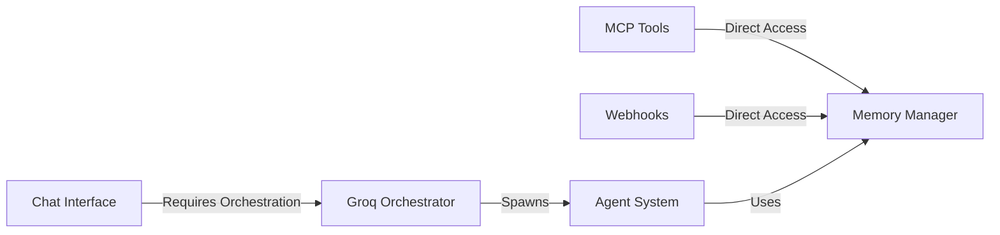
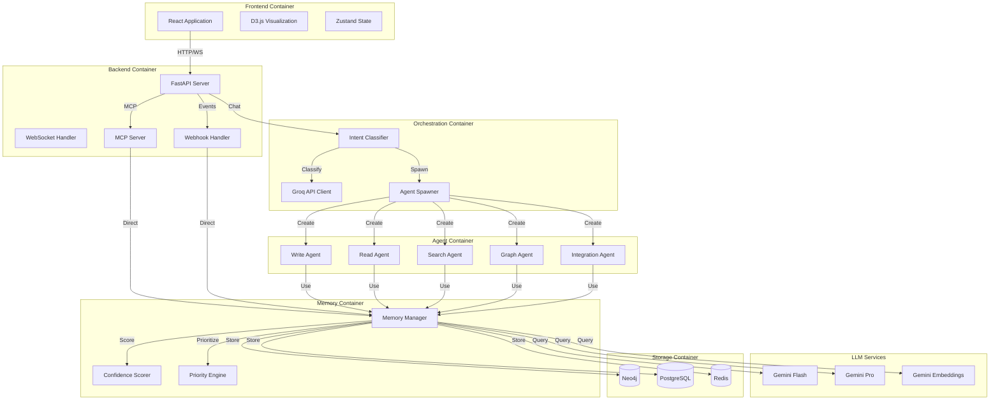
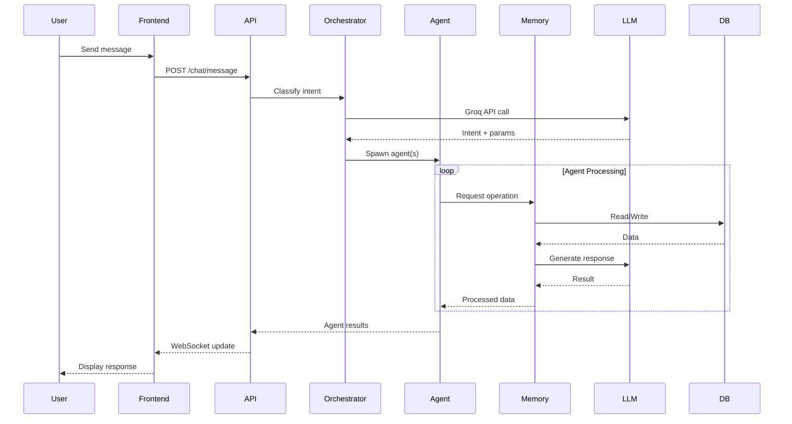
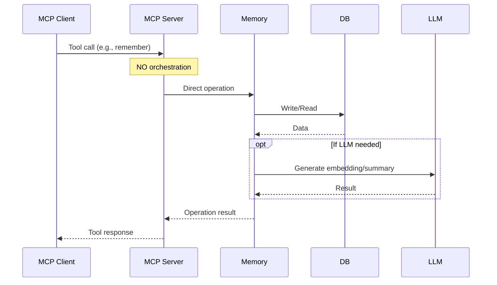
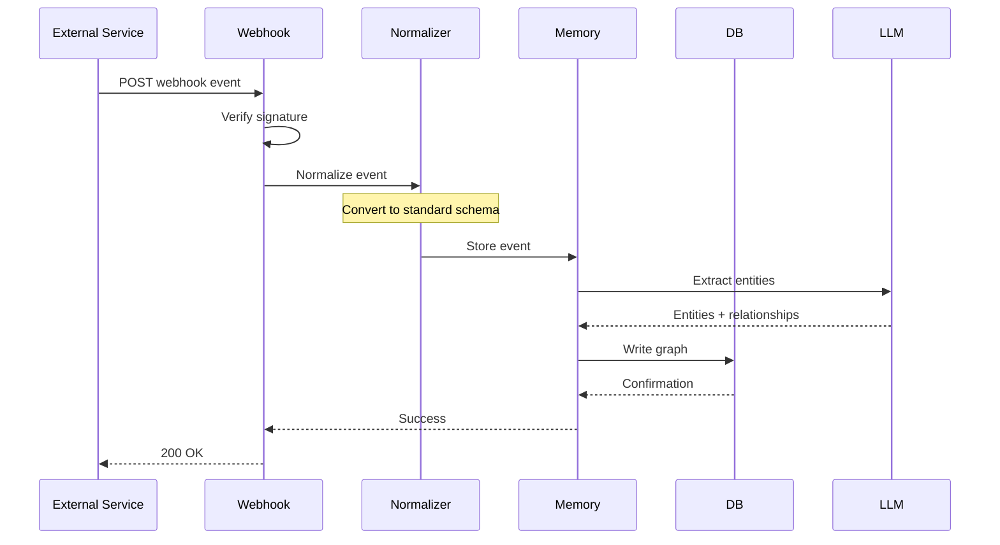
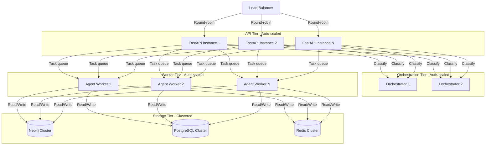
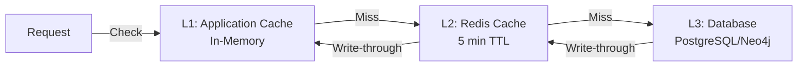
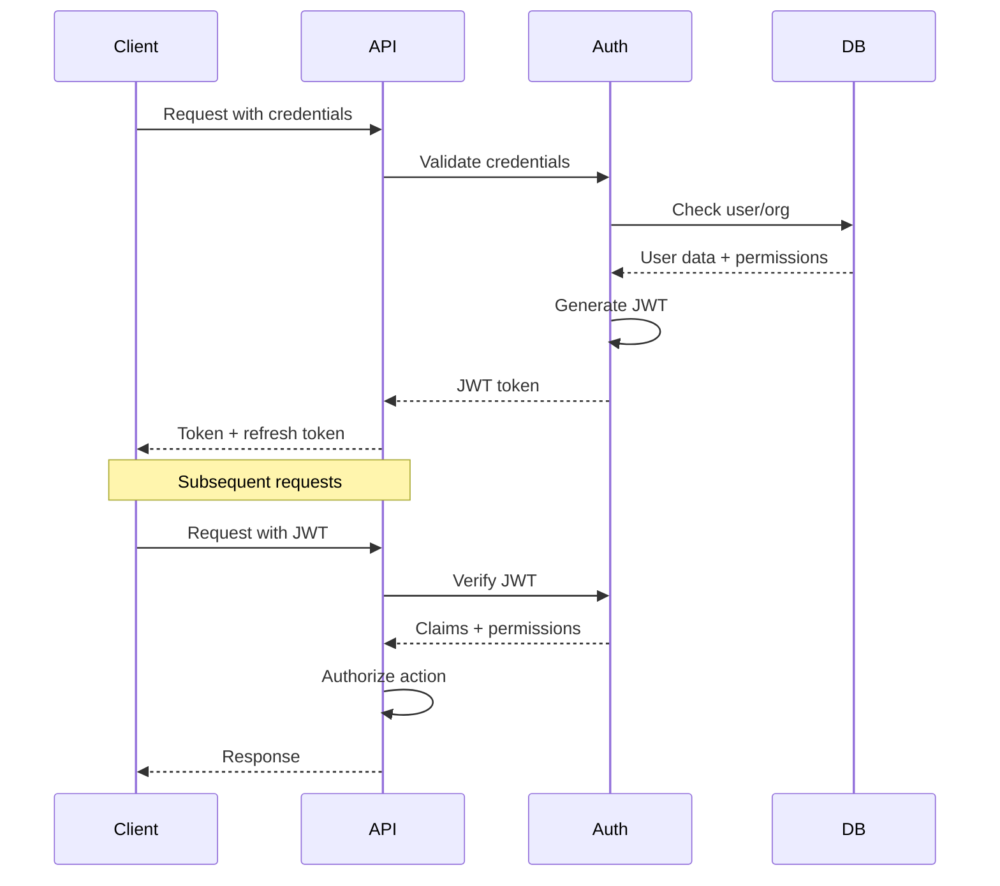
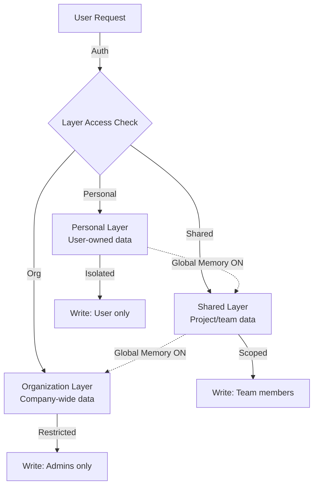
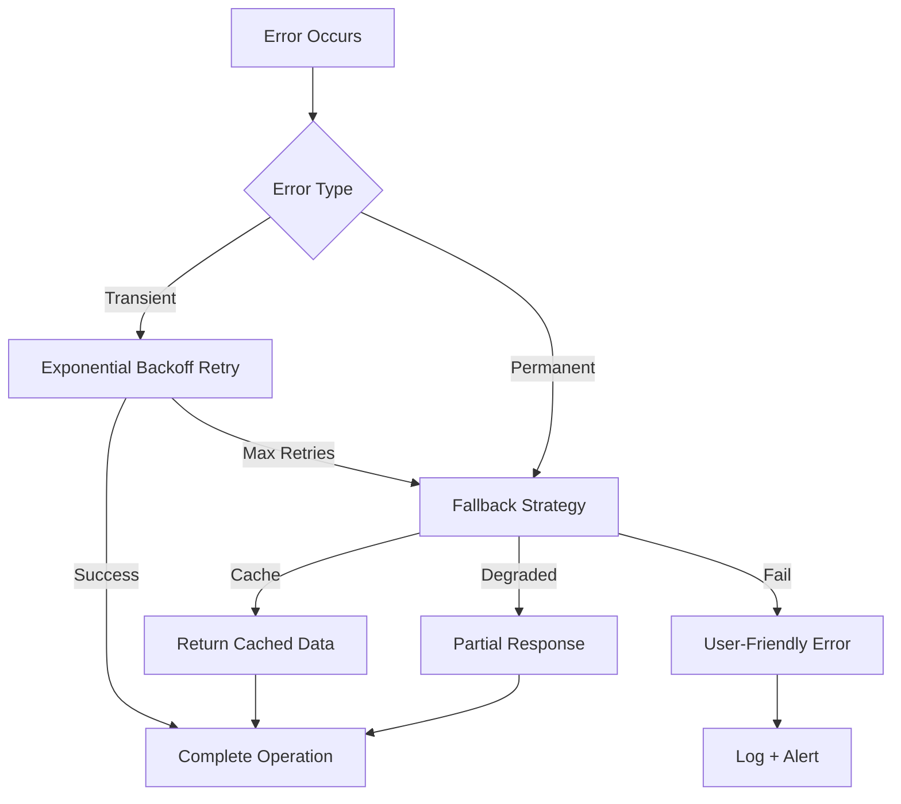

# Architecture Documentation

## Design Principles

### 1. Separation of Concerns

The system is divided into distinct layers with clear responsibilities:

- **Client Layer**: User interfaces (Web, MCP clients)
- **API Layer**: Request routing and protocol handling
- **Orchestration Layer**: Intent classification and agent coordination (chat only)
- **Processing Layer**: Memory operations and LLM interactions
- **Storage Layer**: Persistent data storage

### 2. Orchestration Boundary

**Critical Distinction**: Orchestration only applies to the chat interface. MCP clients and webhooks bypass the orchestrator entirely for direct, deterministic tool execution.



### 3. Stateless Agent Design

All agents are stateless and ephemeral:

- No persistent state between invocations
- Context passed explicitly in each request
- Enables horizontal scaling
- Simplifies error recovery

### 4. Memory Isolation

Three-layer memory architecture with strict isolation:

- **Personal Layer**: User-specific, private
- **Shared Layer**: Team/project-specific, scoped access
- **Organization Layer**: Global, read-only for most users

### 5. Hybrid Search Strategy

Combines graph traversal with vector similarity:

- Graph provides relational context
- Vectors enable semantic similarity
- Fusion algorithms merge results

## Component Architecture



## Data Flow Diagrams

### Flow 1: Chat Interface Query



**Key Characteristics**:
- Intent classification via Groq
- Dynamic agent spawning
- Parallel agent execution where possible
- Aggregated response assembly

### Flow 2: MCP Tool Call



**Key Characteristics**:
- No orchestration overhead
- Direct memory access
- Deterministic tool execution
- Minimal latency

### Flow 3: Webhook Event Processing



**Key Characteristics**:
- Signature verification for security
- Event normalization across providers
- Asynchronous processing via queue
- Automatic entity extraction

## Interface Comparison

### Chat Interface vs MCP Access

| Aspect | Chat Interface | MCP Tools |
|--------|---------------|-----------|
| **Orchestration** | Required (Groq) | None |
| **Agent System** | Dynamic spawning | Direct memory access |
| **Latency** | Higher (orchestration + agents) | Lower (direct calls) |
| **Flexibility** | Natural language, adaptive | Structured tool calls |
| **Use Case** | Interactive exploration | Programmatic integration |
| **Memory Mode** | General or Organization | Determined by API key |
| **Global Memory Toggle** | User-controlled | Always enabled |
| **Cost** | Higher (Groq + Gemini) | Lower (Gemini only) |
| **Parallelization** | Automatic agent coordination | Client-controlled |

### Mode Selection Behavior

#### Chat Interface Modes

**General Mode**:
- Personal memory layer only
- User-specific entities and relationships
- Private context retrieval
- Global Memory toggle controls cross-mode access

**Organization Mode**:
- Select organization from dropdown
- Shared + Organizational layers
- Team-wide context visibility
- Global Memory toggle adds personal layer

#### MCP Client Context

MCP clients operate based on API key scope:
- User-level key: Personal layer access
- Organization-level key: Shared/Organizational layer access
- No mode selection required

## Scaling Strategy

### Horizontal Scaling



### Scaling Targets

| Component | Scaling Metric | Target |
|-----------|---------------|--------|
| **API Servers** | CPU utilization | 70% average |
| **Orchestrators** | Request queue depth | <100 pending |
| **Agent Workers** | Task queue depth | <500 pending |
| **Neo4j** | Connections | <1000 per instance |
| **PostgreSQL** | Connections | <500 per instance |
| **Redis** | Memory utilization | 75% average |

### Caching Strategy



**Cache Layers**:

1. **L1 - Application Memory**: Hot data, 1-minute TTL
2. **L2 - Redis**: Warm data, 5-minute TTL
3. **L3 - Database**: Cold data, persistent

**Cache Invalidation**:
- Write operations invalidate related cache entries
- Time-based expiration for stale data
- Event-driven invalidation for real-time updates

## Security Architecture

### Authentication Flow



### Security Layers

| Layer | Mechanism | Purpose |
|-------|-----------|---------|
| **Transport** | TLS 1.3 | Encryption in transit |
| **Authentication** | JWT tokens | User identity verification |
| **Authorization** | Role-based access control (RBAC) | Permission enforcement |
| **Data** | AES-256 encryption at rest | Data protection |
| **API** | Rate limiting + IP filtering | DDoS protection |
| **Webhook** | HMAC signature verification | Event authenticity |
| **MCP** | API key authentication | Tool access control |

### Memory Layer Isolation



**Isolation Guarantees**:

1. **Personal Layer**: Only accessible by owning user
2. **Shared Layer**: Accessible by project/team members
3. **Organization Layer**: Read access for all org members, write for admins
4. **Global Memory Toggle**: User-controlled cross-layer retrieval (read-only)

## Performance Targets

### Latency Targets

| Operation | p50 | p95 | p99 |
|-----------|-----|-----|-----|
| **Chat message** (orchestrated) | <500ms | <2s | <5s |
| **MCP tool call** (direct) | <100ms | <300ms | <500ms |
| **Graph traversal** | <50ms | <150ms | <300ms |
| **Vector search** | <100ms | <250ms | <500ms |
| **Webhook processing** | <200ms | <500ms | <1s |
| **Entity extraction** | <300ms | <800ms | <2s |
| **WebSocket update** | <50ms | <100ms | <200ms |

### Throughput Targets

| Metric | Target |
|--------|--------|
| **Concurrent users** | 10,000+ |
| **Requests per second** | 1,000+ |
| **Chat messages/minute** | 5,000+ |
| **MCP tool calls/minute** | 10,000+ |
| **Webhook events/minute** | 2,000+ |
| **Graph nodes** | 10M+ |
| **Vector embeddings** | 50M+ |

### Resource Utilization

| Resource | Target | Alert Threshold |
|----------|--------|-----------------|
| **CPU** | 60-70% average | >85% for 5 min |
| **Memory** | 70-80% average | >90% for 2 min |
| **Disk I/O** | <70% utilization | >85% for 5 min |
| **Network** | <60% bandwidth | >80% for 5 min |
| **Database connections** | <60% pool | >80% pool |

## Deployment Architecture

### Local Development

```
Docker Compose Stack:
- Frontend (Vite dev server)
- Backend (FastAPI with hot reload)
- Neo4j (single instance)
- PostgreSQL (single instance)
- Redis (single instance)
```

### Production Deployment

```
Kubernetes Cluster:
- Ingress (NGINX)
- Frontend (static files via CDN)
- Backend (replicated pods)
- Orchestrator (replicated pods)
- Agent workers (horizontal pod autoscaling)
- Neo4j (StatefulSet, 3 replicas)
- PostgreSQL (StatefulSet, streaming replication)
- Redis (StatefulSet, cluster mode)
```

## Monitoring and Observability

### Metrics Collection

- **Application Metrics**: Prometheus
- **Logging**: Structured JSON logs to stdout
- **Tracing**: OpenTelemetry distributed tracing
- **Visualization**: Grafana dashboards

### Key Metrics

1. **Request Metrics**: Rate, duration, errors
2. **Agent Metrics**: Spawn rate, execution time, failure rate
3. **Memory Metrics**: Read/write latency, cache hit rate
4. **Database Metrics**: Query time, connection pool, index usage
5. **LLM Metrics**: API latency, token usage, cost
6. **Business Metrics**: Active users, messages, entities created

## Error Handling

### Error Recovery Strategy



### Retry Policies

| Service | Max Retries | Backoff | Timeout |
|---------|-------------|---------|---------|
| **Gemini API** | 3 | Exponential (1s, 2s, 4s) | 30s |
| **Groq API** | 3 | Exponential (1s, 2s, 4s) | 30s |
| **Neo4j** | 5 | Linear (500ms) | 10s |
| **PostgreSQL** | 5 | Linear (500ms) | 10s |
| **Redis** | 3 | Exponential (100ms, 200ms, 400ms) | 5s |
| **Webhooks** | 10 | Exponential (1m, 5m, 15m, 1h) | 24h |

## Related Documentation

- [API Reference](./api-reference.md) - Detailed API specifications
- [Backend](./backend.md) - Implementation details
- [Agents](./agents.md) - Agent system architecture
- [Memory](./memory.md) - Memory layer design
- [Databases](./databases.md) - Database configuration and optimization
