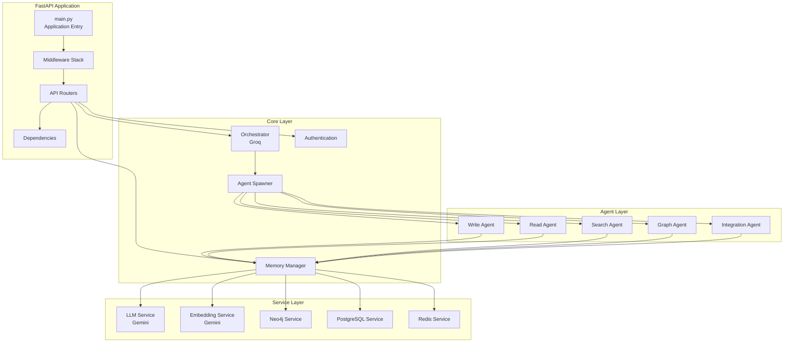

# Backend Documentation

## Overview

The NeuroGraph backend is a Python FastAPI application that provides REST APIs, WebSocket support, MCP server functionality, and webhook handling. The application is containerized using Docker and orchestrates connections to Neo4j, PostgreSQL, and Redis.

## Technology Stack

| Component | Technology | Version |
|-----------|-----------|---------|
| **Framework** | FastAPI | 0.109+ |
| **Language** | Python | 3.11+ |
| **ASGI Server** | Uvicorn | 0.27+ |
| **ORM** | SQLAlchemy | 2.0+ |
| **Migrations** | Alembic | 1.13+ |
| **Validation** | Pydantic | 2.0+ |
| **Graph Client** | neo4j-driver | 5.16+ |
| **Vector DB** | psycopg2 + pgvector | Latest |
| **Cache** | redis-py | 5.0+ |
| **LLM Clients** | google-generativeai, groq | Latest |

## Project Structure

```
backend/
├── app/
│   ├── __init__.py
│   ├── main.py
│   ├── config.py
│   ├── api/
│   │   ├── __init__.py
│   │   ├── routes/
│   │   │   ├── chat.py
│   │   │   ├── memory.py
│   │   │   ├── graph.py
│   │   │   ├── organizations.py
│   │   │   ├── webhooks.py
│   │   │   └── analytics.py
│   │   ├── dependencies.py
│   │   └── middleware.py
│   ├── core/
│   │   ├── __init__.py
│   │   ├── orchestrator.py
│   │   ├── memory-manager.py
│   │   ├── agent-spawner.py
│   │   └── auth.py
│   ├── agents/
│   │   ├── __init__.py
│   │   ├── base-agent.py
│   │   ├── write-agent.py
│   │   ├── read-agent.py
│   │   ├── search-agent.py
│   │   ├── graph-agent.py
│   │   └── integration-agent.py
│   ├── services/
│   │   ├── __init__.py
│   │   ├── llm-service.py
│   │   ├── embedding-service.py
│   │   ├── neo4j-service.py
│   │   ├── postgres-service.py
│   │   └── redis-service.py
│   ├── models/
│   │   ├── __init__.py
│   │   ├── database.py
│   │   ├── entities.py
│   │   ├── memory.py
│   │   └── users.py
│   ├── schemas/
│   │   ├── __init__.py
│   │   ├── chat.py
│   │   ├── memory.py
│   │   ├── graph.py
│   │   └── webhooks.py
│   ├── mcp/
│   │   ├── __init__.py
│   │   ├── server.py
│   │   ├── tools.py
│   │   └── transport.py
│   ├── webhooks/
│   │   ├── __init__.py
│   │   ├── handler.py
│   │   ├── normalizers/
│   │   │   ├── slack.py
│   │   │   ├── github.py
│   │   │   └── gmail.py
│   │   └── validators.py
│   └── utils/
│       ├── __init__.py
│       ├── logging.py
│       ├── metrics.py
│       └── errors.py
├── tests/
│   ├── unit/
│   ├── integration/
│   └── conftest.py
├── alembic/
│   ├── versions/
│   └── env.py
├── requirements.txt
├── Dockerfile
└── docker-compose.yml
```

## Application Architecture



## Main Application

```python
# app/main.py
from fastapi import FastAPI
from fastapi.middleware.cors import CORSMiddleware
from fastapi.middleware.gzip import GZipMiddleware
from contextlib import asynccontextmanager

from app.config import settings
from app.api.routes import chat, memory, graph, organizations, webhooks
from app.api.middleware import RateLimitMiddleware, LoggingMiddleware
from app.core.database import init_db, close_db
from app.utils.logging import setup_logging

@asynccontextmanager
async def lifespan(app: FastAPI):
    # Startup
    setup_logging()
    await init_db()
    logger.info("Application startup complete")
    
    yield
    
    # Shutdown
    await close_db()
    logger.info("Application shutdown complete")

app = FastAPI(
    title="NeuroGraph API",
    description="Knowledge management with graph and vector embeddings",
    version="1.0.0",
    lifespan=lifespan,
)

# Middleware
app.add_middleware(
    CORSMiddleware,
    allow_origins=settings.CORS_ORIGINS,
    allow_credentials=True,
    allow_methods=["*"],
    allow_headers=["*"],
)
app.add_middleware(GZipMiddleware, minimum_size=1000)
app.add_middleware(RateLimitMiddleware)
app.add_middleware(LoggingMiddleware)

# Routes
app.include_router(chat.router, prefix="/chat", tags=["chat"])
app.include_router(memory.router, prefix="/memory", tags=["memory"])
app.include_router(graph.router, prefix="/graph", tags=["graph"])
app.include_router(organizations.router, prefix="/organizations", tags=["organizations"])
app.include_router(webhooks.router, prefix="/webhooks", tags=["webhooks"])

@app.get("/health")
async def health_check():
    return {
        "status": "healthy",
        "version": "1.0.0",
        "services": {
            "neo4j": await check_neo4j(),
            "postgres": await check_postgres(),
            "redis": await check_redis(),
        }
    }

if __name__ == "__main__":
    import uvicorn
    uvicorn.run(
        "app.main:app",
        host="0.0.0.0",
        port=8000,
        reload=settings.DEBUG,
        log_level="info",
    )
```

## Configuration

```python
# app/config.py
from pydantic_settings import BaseSettings
from typing import List

class Settings(BaseSettings):
    # Application
    APP_NAME: str = "NeuroGraph"
    DEBUG: bool = False
    ENVIRONMENT: str = "production"
    
    # API
    API_V1_PREFIX: str = "/api/v1"
    CORS_ORIGINS: List[str] = ["http://localhost:5173"]
    
    # Database - PostgreSQL
    POSTGRES_HOST: str = "localhost"
    POSTGRES_PORT: int = 5432
    POSTGRES_DB: str = "neurograph"
    POSTGRES_USER: str = "neurograph"
    POSTGRES_PASSWORD: str
    
    @property
    def DATABASE_URL(self) -> str:
        return f"postgresql://{self.POSTGRES_USER}:{self.POSTGRES_PASSWORD}@{self.POSTGRES_HOST}:{self.POSTGRES_PORT}/{self.POSTGRES_DB}"
    
    # Database - Neo4j
    NEO4J_URI: str = "bolt://localhost:7687"
    NEO4J_USER: str = "neo4j"
    NEO4J_PASSWORD: str
    
    # Cache - Redis
    REDIS_URL: str = "redis://localhost:6379"
    REDIS_PASSWORD: str = ""
    
    # LLM - Gemini
    GEMINI_API_KEY: str
    GEMINI_MODEL_FLASH: str = "gemini-1.5-flash"
    GEMINI_MODEL_PRO: str = "gemini-1.5-pro"
    GEMINI_EMBEDDING_MODEL: str = "models/embedding-001"
    
    # LLM - Groq
    GROQ_API_KEY: str
    GROQ_MODEL: str = "llama-3.3-70b-versatile"
    
    # Authentication
    SECRET_KEY: str
    ALGORITHM: str = "HS256"
    ACCESS_TOKEN_EXPIRE_MINUTES: int = 60
    REFRESH_TOKEN_EXPIRE_DAYS: int = 7
    
    # Rate Limiting
    RATE_LIMIT_PER_MINUTE: int = 60
    RATE_LIMIT_PER_HOUR: int = 1000
    
    # Memory
    MEMORY_CONFIDENCE_THRESHOLD: float = 0.5
    MEMORY_TEMPORAL_DECAY_DAYS: int = 365
    
    # Vector Search
    VECTOR_DIMENSIONS: int = 768
    VECTOR_SIMILARITY_THRESHOLD: float = 0.7
    
    # Graph
    GRAPH_MAX_TRAVERSAL_DEPTH: int = 5
    
    class Config:
        env_file = ".env"
        case_sensitive = True

settings = Settings()
```

## Docker Setup

### Dockerfile

```dockerfile
FROM python:3.11-slim

WORKDIR /app

# Install system dependencies
RUN apt-get update && apt-get install -y \
    build-essential \
    libpq-dev \
    && rm -rf /var/lib/apt/lists/*

# Install Python dependencies
COPY requirements.txt .
RUN pip install --no-cache-dir -r requirements.txt

# Copy application
COPY . .

# Create non-root user
RUN useradd -m -u 1000 neurograph && \
    chown -R neurograph:neurograph /app
USER neurograph

# Expose port
EXPOSE 8000

# Run application
CMD ["uvicorn", "app.main:app", "--host", "0.0.0.0", "--port", "8000"]
```

### Docker Compose

```yaml
# docker-compose.yml
version: '3.8'

services:
  # Backend API
  backend:
    build: ./backend
    container_name: neurograph-backend
    ports:
      - "8000:8000"
    env_file:
      - ./backend/.env
    depends_on:
      - postgres
      - neo4j
      - redis
    volumes:
      - ./backend:/app
    networks:
      - neurograph-network
    restart: unless-stopped

  # Frontend
  frontend:
    build: ./frontend
    container_name: neurograph-frontend
    ports:
      - "5173:80"
    depends_on:
      - backend
    networks:
      - neurograph-network
    restart: unless-stopped

  # PostgreSQL with pgvector
  postgres:
    image: pgvector/pgvector:pg16
    container_name: neurograph-postgres
    environment:
      POSTGRES_DB: neurograph
      POSTGRES_USER: neurograph
      POSTGRES_PASSWORD: ${POSTGRES_PASSWORD}
    ports:
      - "5432:5432"
    volumes:
      - postgres-data:/var/lib/postgresql/data
    networks:
      - neurograph-network
    restart: unless-stopped

  # Neo4j
  neo4j:
    image: neo4j:5.16
    container_name: neurograph-neo4j
    environment:
      NEO4J_AUTH: neo4j/${NEO4J_PASSWORD}
      NEO4J_PLUGINS: '["apoc", "graph-data-science"]'
      NEO4J_dbms_memory_heap_max__size: 2G
      NEO4J_dbms_memory_pagecache_size: 1G
    ports:
      - "7474:7474"  # HTTP
      - "7687:7687"  # Bolt
    volumes:
      - neo4j-data:/data
      - neo4j-logs:/logs
    networks:
      - neurograph-network
    restart: unless-stopped

  # Redis (Upstash-compatible)
  redis:
    image: redis:7-alpine
    container_name: neurograph-redis
    command: redis-server --requirepass ${REDIS_PASSWORD}
    ports:
      - "6379:6379"
    volumes:
      - redis-data:/data
    networks:
      - neurograph-network
    restart: unless-stopped

volumes:
  postgres-data:
  neo4j-data:
  neo4j-logs:
  redis-data:

networks:
  neurograph-network:
    driver: bridge
```

## Database Migrations

### Alembic Setup

```python
# alembic/env.py
from logging.config import fileConfig
from sqlalchemy import engine_from_config, pool
from alembic import context

from app.config import settings
from app.models.database import Base

config = context.config
config.set_main_option("sqlalchemy.url", settings.DATABASE_URL)

fileConfig(config.config_file_name)

target_metadata = Base.metadata

def run_migrations_online():
    connectable = engine_from_config(
        config.get_section(config.config_ini_section),
        prefix="sqlalchemy.",
        poolclass=pool.NullPool,
    )

    with connectable.connect() as connection:
        context.configure(
            connection=connection,
            target_metadata=target_metadata
        )

        with context.begin_transaction():
            context.run_migrations()

run_migrations_online()
```

### Create Migration

```bash
# Create a new migration
alembic revision --autogenerate -m "create_users_table"

# Apply migrations
alembic upgrade head

# Rollback migration
alembic downgrade -1
```

## Environment Configuration

### Development (.env.example)

```bash
# Application
DEBUG=true
ENVIRONMENT=development

# PostgreSQL
POSTGRES_HOST=localhost
POSTGRES_PORT=5432
POSTGRES_DB=neurograph
POSTGRES_USER=neurograph
POSTGRES_PASSWORD=your-secure-password

# Neo4j
NEO4J_URI=bolt://localhost:7687
NEO4J_USER=neo4j
NEO4J_PASSWORD=your-secure-password

# Redis
REDIS_URL=redis://localhost:6379
REDIS_PASSWORD=your-secure-password

# Gemini
GEMINI_API_KEY=your-gemini-api-key

# Groq
GROQ_API_KEY=your-groq-api-key

# Authentication
SECRET_KEY=your-secret-key-min-32-chars
```

## Deployment Guide

### Local Development

```bash
# Clone repository
git clone https://github.com/your-org/neurograph.git
cd neurograph

# Create virtual environment
python -m venv venv
source venv/bin/activate  # On Windows: venv\Scripts\activate

# Install dependencies
cd backend
pip install -r requirements.txt

# Copy environment file
cp .env.example .env
# Edit .env with your configuration

# Start infrastructure
docker-compose up -d postgres neo4j redis

# Run migrations
alembic upgrade head

# Start backend
uvicorn app.main:app --reload --host 0.0.0.0 --port 8000
```

### Docker Development

```bash
# Start all services
docker-compose up -d

# View logs
docker-compose logs -f backend

# Stop services
docker-compose down

# Rebuild after code changes
docker-compose up -d --build
```

### Production Deployment

```bash
# Build production image
docker build -t neurograph-backend:latest ./backend

# Tag for registry
docker tag neurograph-backend:latest registry.example.com/neurograph-backend:latest

# Push to registry
docker push registry.example.com/neurograph-backend:latest

# Deploy with docker-compose
docker-compose -f docker-compose.prod.yml up -d

# Or deploy to Kubernetes
kubectl apply -f k8s/
```

### Production Configuration

```yaml
# docker-compose.prod.yml
version: '3.8'

services:
  backend:
    image: registry.example.com/neurograph-backend:latest
    environment:
      - DEBUG=false
      - ENVIRONMENT=production
    deploy:
      replicas: 3
      resources:
        limits:
          cpus: '2'
          memory: 4G
        reservations:
          cpus: '1'
          memory: 2G
    healthcheck:
      test: ["CMD", "curl", "-f", "http://localhost:8000/health"]
      interval: 30s
      timeout: 10s
      retries: 3
      start_period: 40s
```

## API Route Examples

### Chat Route

```python
# app/api/routes/chat.py
from fastapi import APIRouter, Depends, HTTPException
from typing import List

from app.schemas.chat import ChatRequest, ChatResponse
from app.core.orchestrator import Orchestrator
from app.core.auth import get_current_user
from app.models.users import User

router = APIRouter()

@router.post("/message", response_model=ChatResponse)
async def send_message(
    request: ChatRequest,
    user: User = Depends(get_current_user),
    orchestrator: Orchestrator = Depends(),
):
    """
    Send a chat message and receive an orchestrated response.
    """
    try:
        # Classify intent and spawn agents
        result = await orchestrator.process_message(
            message=request.message,
            user_id=user.id,
            mode=request.mode,
            organization_id=request.organization_id,
            global_memory=request.global_memory,
            conversation_id=request.conversation_id,
        )
        
        return ChatResponse(
            response=result.response,
            conversation_id=result.conversation_id,
            agents_used=result.agents_used,
            entities_retrieved=result.entities_retrieved,
            sources=result.sources,
            execution_time_ms=result.execution_time_ms,
            tokens_used=result.tokens_used,
        )
    except Exception as e:
        logger.error(f"Chat error: {str(e)}")
        raise HTTPException(status_code=500, detail=str(e))
```

## Testing

### Pytest Configuration

```python
# tests/conftest.py
import pytest
from fastapi.testclient import TestClient
from sqlalchemy import create_engine
from sqlalchemy.orm import sessionmaker

from app.main import app
from app.models.database import Base
from app.api.dependencies import get_db

SQLALCHEMY_DATABASE_URL = "sqlite:///./test.db"

engine = create_engine(SQLALCHEMY_DATABASE_URL, connect_args={"check_same_thread": False})
TestingSessionLocal = sessionmaker(autocommit=False, autoflush=False, bind=engine)

@pytest.fixture(scope="function")
def db():
    Base.metadata.create_all(bind=engine)
    db = TestingSessionLocal()
    try:
        yield db
    finally:
        db.close()
        Base.metadata.drop_all(bind=engine)

@pytest.fixture(scope="function")
def client(db):
    def override_get_db():
        try:
            yield db
        finally:
            db.close()
    
    app.dependency_overrides[get_db] = override_get_db
    yield TestClient(app)
    app.dependency_overrides.clear()
```

### Run Tests

```bash
# Run all tests
pytest

# Run with coverage
pytest --cov=app --cov-report=html

# Run specific test file
pytest tests/unit/test_memory.py

# Run with verbose output
pytest -v
```

## Monitoring

### Logging

```python
# app/utils/logging.py
import logging
import sys
from app.config import settings

def setup_logging():
    logging.basicConfig(
        level=logging.DEBUG if settings.DEBUG else logging.INFO,
        format='%(asctime)s - %(name)s - %(levelname)s - %(message)s',
        handlers=[
            logging.StreamHandler(sys.stdout),
            logging.FileHandler('logs/app.log'),
        ]
    )
```

### Metrics

```python
# app/utils/metrics.py
from prometheus_client import Counter, Histogram, Gauge

request_count = Counter('http_requests_total', 'Total HTTP requests', ['method', 'endpoint'])
request_duration = Histogram('http_request_duration_seconds', 'HTTP request duration')
active_connections = Gauge('active_connections', 'Active WebSocket connections')
```

## Related Documentation

- [API Reference](./api-reference.md) - Complete API documentation
- [Architecture](./architecture.md) - System architecture
- [Databases](./databases.md) - Database setup and configuration
- [Agents](./agents.md) - Agent system implementation
