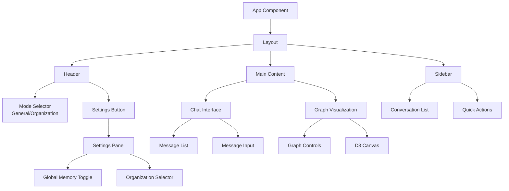

# Frontend Documentation

## Overview

The NeuroGraph frontend is a modern React application built with Vite, providing an interactive chat interface and real-time graph visualization. The application supports two operational modes (General and Organization), global memory toggle, and live WebSocket updates for graph changes.

## Technology Stack

| Technology | Purpose |
|-----------|---------|
| **Vite** | Build tool and dev server |
| **React 18** | UI framework |
| **TypeScript** | Type-safe JavaScript |
| **Zustand** | State management |
| **D3.js** | Graph visualization |
| **TanStack Query** | Server state management |
| **WebSocket** | Real-time updates |
| **Tailwind CSS** | Styling |
| **Radix UI** | Accessible components |

## Project Structure

```
frontend/
├── src/
│   ├── components/
│   │   ├── chat/
│   │   │   ├── chat-interface.tsx
│   │   │   ├── message-list.tsx
│   │   │   ├── message-input.tsx
│   │   │   └── mode-selector.tsx
│   │   ├── graph/
│   │   │   ├── graph-visualization.tsx
│   │   │   ├── graph-controls.tsx
│   │   │   ├── node-renderer.tsx
│   │   │   └── edge-renderer.tsx
│   │   ├── settings/
│   │   │   ├── settings-panel.tsx
│   │   │   ├── global-memory-toggle.tsx
│   │   │   └── organization-selector.tsx
│   │   └── common/
│   │       ├── layout.tsx
│   │       ├── header.tsx
│   │       └── sidebar.tsx
│   ├── hooks/
│   │   ├── use-chat.ts
│   │   ├── use-graph.ts
│   │   ├── use-websocket.ts
│   │   └── use-memory.ts
│   ├── stores/
│   │   ├── chat-store.ts
│   │   ├── graph-store.ts
│   │   ├── settings-store.ts
│   │   └── auth-store.ts
│   ├── services/
│   │   ├── api-client.ts
│   │   ├── websocket-client.ts
│   │   └── graph-service.ts
│   ├── types/
│   │   ├── chat.ts
│   │   ├── graph.ts
│   │   └── api.ts
│   ├── utils/
│   │   ├── graph-layout.ts
│   │   ├── color-scheme.ts
│   │   └── date-formatter.ts
│   ├── App.tsx
│   └── main.tsx
├── public/
├── index.html
├── vite.config.ts
├── tsconfig.json
├── tailwind.config.js
└── package.json
```

## Component Architecture



## State Management

### Zustand Stores

#### Chat Store

```typescript
// stores/chat-store.ts
import { create } from 'zustand';
import { persist } from 'zustand/middleware';

interface Message {
  id: string;
  role: 'user' | 'assistant';
  content: string;
  timestamp: Date;
  metadata?: {
    agentsUsed?: string[];
    executionTimeMs?: number;
    sources?: any[];
  };
}

interface Conversation {
  id: string;
  mode: 'general' | 'organization';
  organizationId?: string;
  messages: Message[];
  createdAt: Date;
  updatedAt: Date;
}

interface ChatStore {
  // State
  conversations: Map<string, Conversation>;
  currentConversationId: string | null;
  isLoading: boolean;
  
  // Mode settings
  mode: 'general' | 'organization';
  selectedOrganizationId: string | null;
  globalMemory: boolean;
  
  // Actions
  setMode: (mode: 'general' | 'organization') => void;
  setOrganization: (orgId: string | null) => void;
  toggleGlobalMemory: () => void;
  sendMessage: (content: string) => Promise<void>;
  createConversation: () => void;
  loadConversation: (id: string) => void;
  deleteConversation: (id: string) => void;
}

export const useChatStore = create<ChatStore>()(
  persist(
    (set, get) => ({
      conversations: new Map(),
      currentConversationId: null,
      isLoading: false,
      mode: 'general',
      selectedOrganizationId: null,
      globalMemory: true,
      
      setMode: (mode) => set({ mode }),
      
      setOrganization: (orgId) => set({ selectedOrganizationId: orgId }),
      
      toggleGlobalMemory: () => 
        set((state) => ({ globalMemory: !state.globalMemory })),
      
      sendMessage: async (content) => {
        const state = get();
        set({ isLoading: true });
        
        try {
          const response = await apiClient.chat.sendMessage({
            message: content,
            mode: state.mode,
            organizationId: state.selectedOrganizationId,
            globalMemory: state.globalMemory,
            conversationId: state.currentConversationId,
          });
          
          // Update conversation with new messages
          const conversation = state.conversations.get(
            state.currentConversationId!
          );
          
          if (conversation) {
            conversation.messages.push(
              {
                id: generateId(),
                role: 'user',
                content,
                timestamp: new Date(),
              },
              {
                id: response.id,
                role: 'assistant',
                content: response.response,
                timestamp: new Date(),
                metadata: {
                  agentsUsed: response.agentsUsed,
                  executionTimeMs: response.executionTimeMs,
                  sources: response.sources,
                },
              }
            );
            
            set({
              conversations: new Map(state.conversations),
            });
          }
        } finally {
          set({ isLoading: false });
        }
      },
      
      createConversation: () => {
        const state = get();
        const id = generateId();
        const newConversation: Conversation = {
          id,
          mode: state.mode,
          organizationId: state.selectedOrganizationId,
          messages: [],
          createdAt: new Date(),
          updatedAt: new Date(),
        };
        
        state.conversations.set(id, newConversation);
        set({
          conversations: new Map(state.conversations),
          currentConversationId: id,
        });
      },
      
      loadConversation: (id) => set({ currentConversationId: id }),
      
      deleteConversation: (id) => {
        const state = get();
        state.conversations.delete(id);
        set({
          conversations: new Map(state.conversations),
          currentConversationId: null,
        });
      },
    }),
    {
      name: 'chat-storage',
      partialize: (state) => ({
        mode: state.mode,
        selectedOrganizationId: state.selectedOrganizationId,
        globalMemory: state.globalMemory,
      }),
    }
  )
);
```

#### Graph Store

```typescript
// stores/graph-store.ts
import { create } from 'zustand';

interface Node {
  id: string;
  name: string;
  type: string;
  properties: Record<string, any>;
  x?: number;
  y?: number;
}

interface Edge {
  id: string;
  source: string;
  target: string;
  type: string;
  properties: Record<string, any>;
}

interface GraphStore {
  // State
  nodes: Node[];
  edges: Edge[];
  selectedNodeId: string | null;
  hoveredNodeId: string | null;
  
  // View state
  zoom: number;
  pan: { x: number; y: number };
  layout: 'force' | 'hierarchical' | 'radial';
  
  // Filters
  nodeTypeFilters: Set<string>;
  edgeTypeFilters: Set<string>;
  
  // Actions
  setNodes: (nodes: Node[]) => void;
  setEdges: (edges: Edge[]) => void;
  addNode: (node: Node) => void;
  addEdge: (edge: Edge) => void;
  removeNode: (id: string) => void;
  removeEdge: (id: string) => void;
  selectNode: (id: string | null) => void;
  hoverNode: (id: string | null) => void;
  setZoom: (zoom: number) => void;
  setPan: (pan: { x: number; y: number }) => void;
  setLayout: (layout: 'force' | 'hierarchical' | 'radial') => void;
  toggleNodeTypeFilter: (type: string) => void;
  toggleEdgeTypeFilter: (type: string) => void;
  resetFilters: () => void;
}

export const useGraphStore = create<GraphStore>((set) => ({
  nodes: [],
  edges: [],
  selectedNodeId: null,
  hoveredNodeId: null,
  zoom: 1,
  pan: { x: 0, y: 0 },
  layout: 'force',
  nodeTypeFilters: new Set(),
  edgeTypeFilters: new Set(),
  
  setNodes: (nodes) => set({ nodes }),
  setEdges: (edges) => set({ edges }),
  
  addNode: (node) =>
    set((state) => ({ nodes: [...state.nodes, node] })),
  
  addEdge: (edge) =>
    set((state) => ({ edges: [...state.edges, edge] })),
  
  removeNode: (id) =>
    set((state) => ({
      nodes: state.nodes.filter((n) => n.id !== id),
      edges: state.edges.filter(
        (e) => e.source !== id && e.target !== id
      ),
    })),
  
  removeEdge: (id) =>
    set((state) => ({
      edges: state.edges.filter((e) => e.id !== id),
    })),
  
  selectNode: (id) => set({ selectedNodeId: id }),
  hoverNode: (id) => set({ hoveredNodeId: id }),
  setZoom: (zoom) => set({ zoom }),
  setPan: (pan) => set({ pan }),
  setLayout: (layout) => set({ layout }),
  
  toggleNodeTypeFilter: (type) =>
    set((state) => {
      const filters = new Set(state.nodeTypeFilters);
      if (filters.has(type)) {
        filters.delete(type);
      } else {
        filters.add(type);
      }
      return { nodeTypeFilters: filters };
    }),
  
  toggleEdgeTypeFilter: (type) =>
    set((state) => {
      const filters = new Set(state.edgeTypeFilters);
      if (filters.has(type)) {
        filters.delete(type);
      } else {
        filters.add(type);
      }
      return { edgeTypeFilters: filters };
    }),
  
  resetFilters: () =>
    set({
      nodeTypeFilters: new Set(),
      edgeTypeFilters: new Set(),
    }),
}));
```

## D3.js Graph Visualization

### Graph Component

```typescript
// components/graph/graph-visualization.tsx
import React, { useEffect, useRef } from 'react';
import * as d3 from 'd3';
import { useGraphStore } from '@/stores/graph-store';
import { useWebSocket } from '@/hooks/use-websocket';

export const GraphVisualization: React.FC = () => {
  const svgRef = useRef<SVGSVGElement>(null);
  const {
    nodes,
    edges,
    selectedNodeId,
    selectNode,
    hoverNode,
    zoom,
    pan,
    layout,
  } = useGraphStore();
  
  // Subscribe to real-time graph updates
  useWebSocket({
    channel: 'graph_updates',
    onMessage: (data) => {
      if (data.event === 'entity_created') {
        useGraphStore.getState().addNode(data.data);
      } else if (data.event === 'relationship_created') {
        useGraphStore.getState().addEdge(data.data);
      }
    },
  });
  
  useEffect(() => {
    if (!svgRef.current) return;
    
    const svg = d3.select(svgRef.current);
    const width = svgRef.current.clientWidth;
    const height = svgRef.current.clientHeight;
    
    // Clear previous content
    svg.selectAll('*').remove();
    
    // Create main group for zoom/pan
    const g = svg.append('g');
    
    // Setup zoom behavior
    const zoomBehavior = d3.zoom()
      .scaleExtent([0.1, 4])
      .on('zoom', (event) => {
        g.attr('transform', event.transform);
        useGraphStore.getState().setZoom(event.transform.k);
        useGraphStore.getState().setPan({
          x: event.transform.x,
          y: event.transform.y,
        });
      });
    
    svg.call(zoomBehavior as any);
    
    // Create force simulation
    const simulation = d3.forceSimulation(nodes as any)
      .force('link', d3.forceLink(edges)
        .id((d: any) => d.id)
        .distance(100))
      .force('charge', d3.forceManyBody().strength(-300))
      .force('center', d3.forceCenter(width / 2, height / 2))
      .force('collision', d3.forceCollide().radius(30));
    
    // Render edges
    const link = g.append('g')
      .selectAll('line')
      .data(edges)
      .join('line')
      .attr('stroke', '#999')
      .attr('stroke-opacity', 0.6)
      .attr('stroke-width', 2);
    
    // Render edge labels
    const edgeLabel = g.append('g')
      .selectAll('text')
      .data(edges)
      .join('text')
      .attr('font-size', 10)
      .attr('fill', '#666')
      .text((d) => d.type);
    
    // Render nodes
    const node = g.append('g')
      .selectAll('circle')
      .data(nodes)
      .join('circle')
      .attr('r', 20)
      .attr('fill', (d) => getNodeColor(d.type))
      .attr('stroke', (d) => 
        d.id === selectedNodeId ? '#000' : '#fff'
      )
      .attr('stroke-width', (d) => 
        d.id === selectedNodeId ? 3 : 1.5
      )
      .style('cursor', 'pointer')
      .on('click', (event, d) => {
        event.stopPropagation();
        selectNode(d.id);
      })
      .on('mouseenter', (event, d) => {
        hoverNode(d.id);
      })
      .on('mouseleave', () => {
        hoverNode(null);
      })
      .call(drag(simulation) as any);
    
    // Render node labels
    const nodeLabel = g.append('g')
      .selectAll('text')
      .data(nodes)
      .join('text')
      .attr('text-anchor', 'middle')
      .attr('dy', 35)
      .attr('font-size', 12)
      .text((d) => d.name);
    
    // Update positions on tick
    simulation.on('tick', () => {
      link
        .attr('x1', (d: any) => d.source.x)
        .attr('y1', (d: any) => d.source.y)
        .attr('x2', (d: any) => d.target.x)
        .attr('y2', (d: any) => d.target.y);
      
      edgeLabel
        .attr('x', (d: any) => (d.source.x + d.target.x) / 2)
        .attr('y', (d: any) => (d.source.y + d.target.y) / 2);
      
      node
        .attr('cx', (d: any) => d.x)
        .attr('cy', (d: any) => d.y);
      
      nodeLabel
        .attr('x', (d: any) => d.x)
        .attr('y', (d: any) => d.y);
    });
    
    return () => {
      simulation.stop();
    };
  }, [nodes, edges, selectedNodeId, layout]);
  
  return (
    <svg
      ref={svgRef}
      className="w-full h-full"
      style={{ background: '#f9fafb' }}
    />
  );
};

// Drag behavior
function drag(simulation: d3.Simulation<any, any>) {
  function dragstarted(event: any) {
    if (!event.active) simulation.alphaTarget(0.3).restart();
    event.subject.fx = event.subject.x;
    event.subject.fy = event.subject.y;
  }
  
  function dragged(event: any) {
    event.subject.fx = event.x;
    event.subject.fy = event.y;
  }
  
  function dragended(event: any) {
    if (!event.active) simulation.alphaTarget(0);
    event.subject.fx = null;
    event.subject.fy = null;
  }
  
  return d3.drag()
    .on('start', dragstarted)
    .on('drag', dragged)
    .on('end', dragended);
}

// Node color mapping
function getNodeColor(type: string): string {
  const colorMap: Record<string, string> = {
    person: '#3b82f6',
    project: '#10b981',
    document: '#f59e0b',
    event: '#8b5cf6',
    organization: '#ef4444',
  };
  return colorMap[type] || '#6b7280';
}
```

## WebSocket Integration

### WebSocket Hook

```typescript
// hooks/use-websocket.ts
import { useEffect, useRef } from 'react';
import { useAuthStore } from '@/stores/auth-store';

interface UseWebSocketOptions {
  channel: string;
  onMessage: (data: any) => void;
  onError?: (error: Event) => void;
}

export const useWebSocket = ({
  channel,
  onMessage,
  onError,
}: UseWebSocketOptions) => {
  const wsRef = useRef<WebSocket | null>(null);
  const { token } = useAuthStore();
  
  useEffect(() => {
    const ws = new WebSocket(
      `ws://localhost:8000/ws?token=${token}`
    );
    
    ws.onopen = () => {
      console.log('WebSocket connected');
      ws.send(JSON.stringify({
        type: 'subscribe',
        channel,
      }));
    };
    
    ws.onmessage = (event) => {
      const data = JSON.parse(event.data);
      onMessage(data);
    };
    
    ws.onerror = (error) => {
      console.error('WebSocket error:', error);
      onError?.(error);
    };
    
    ws.onclose = () => {
      console.log('WebSocket disconnected');
    };
    
    wsRef.current = ws;
    
    return () => {
      ws.close();
    };
  }, [channel, token]);
  
  return wsRef.current;
};
```

## Mode Selection Components

### Mode Selector

```typescript
// components/chat/mode-selector.tsx
import React from 'react';
import { useChatStore } from '@/stores/chat-store';
import { useOrganizations } from '@/hooks/use-organizations';

export const ModeSelector: React.FC = () => {
  const { mode, setMode, selectedOrganizationId, setOrganization } = 
    useChatStore();
  const { data: organizations } = useOrganizations();
  
  return (
    <div className="flex items-center gap-4">
      <select
        value={mode}
        onChange={(e) => setMode(e.target.value as any)}
        className="px-4 py-2 border rounded-lg"
      >
        <option value="general">General</option>
        <option value="organization">Organization</option>
      </select>
      
      {mode === 'organization' && (
        <select
          value={selectedOrganizationId || ''}
          onChange={(e) => setOrganization(e.target.value || null)}
          className="px-4 py-2 border rounded-lg"
        >
          <option value="">Select Organization</option>
          {organizations?.map((org) => (
            <option key={org.id} value={org.id}>
              {org.name}
            </option>
          ))}
        </select>
      )}
    </div>
  );
};
```

### Global Memory Toggle

```typescript
// components/settings/global-memory-toggle.tsx
import React from 'react';
import { useChatStore } from '@/stores/chat-store';

export const GlobalMemoryToggle: React.FC = () => {
  const { globalMemory, toggleGlobalMemory } = useChatStore();
  
  return (
    <div className="flex items-center justify-between p-4 border rounded-lg">
      <div>
        <h3 className="font-semibold">Global Memory</h3>
        <p className="text-sm text-gray-600">
          Enable cross-layer memory access for richer context
        </p>
      </div>
      <button
        onClick={toggleGlobalMemory}
        className={`relative inline-flex h-6 w-11 items-center rounded-full transition-colors ${
          globalMemory ? 'bg-blue-600' : 'bg-gray-200'
        }`}
      >
        <span
          className={`inline-block h-4 w-4 transform rounded-full bg-white transition-transform ${
            globalMemory ? 'translate-x-6' : 'translate-x-1'
          }`}
        />
      </button>
    </div>
  );
};
```

## Build and Deployment

### Development

```bash
# Install dependencies
npm install

# Start dev server
npm run dev

# Type checking
npm run type-check

# Linting
npm run lint

# Format code
npm run format
```

### Production Build

```bash
# Build for production
npm run build

# Preview production build
npm run preview
```

### Docker Deployment

```dockerfile
# Dockerfile
FROM node:20-alpine AS builder

WORKDIR /app
COPY package*.json ./
RUN npm ci
COPY . .
RUN npm run build

FROM nginx:alpine
COPY --from=builder /app/dist /usr/share/nginx/html
COPY nginx.conf /etc/nginx/conf.d/default.conf
EXPOSE 80
CMD ["nginx", "-g", "daemon off;"]
```

### Environment Variables

```bash
# .env
VITE_API_URL=http://localhost:8000
VITE_WS_URL=ws://localhost:8000
VITE_ENVIRONMENT=development
```

## Testing

### Unit Tests

```typescript
// components/chat/__tests__/mode-selector.test.tsx
import { render, screen, fireEvent } from '@testing-library/react';
import { ModeSelector } from '../mode-selector';

describe('ModeSelector', () => {
  it('renders mode options', () => {
    render(<ModeSelector />);
    expect(screen.getByText('General')).toBeInTheDocument();
    expect(screen.getByText('Organization')).toBeInTheDocument();
  });
  
  it('switches mode on selection', () => {
    render(<ModeSelector />);
    const select = screen.getByRole('combobox');
    fireEvent.change(select, { target: { value: 'organization' } });
    expect(useChatStore.getState().mode).toBe('organization');
  });
});
```

## Performance Optimization

### Code Splitting

```typescript
// Lazy load heavy components
const GraphVisualization = React.lazy(() => 
  import('@/components/graph/graph-visualization')
);

// Use with Suspense
<Suspense fallback={<LoadingSpinner />}>
  <GraphVisualization />
</Suspense>
```

### Memoization

```typescript
// Memoize expensive calculations
const filteredNodes = useMemo(() => {
  return nodes.filter(node => 
    !nodeTypeFilters.has(node.type)
  );
}, [nodes, nodeTypeFilters]);
```

## Related Documentation

- [API Reference](./api-reference.md) - API endpoints used by frontend
- [Backend](./backend.md) - Backend integration details
- [Architecture](./architecture.md) - System architecture overview
