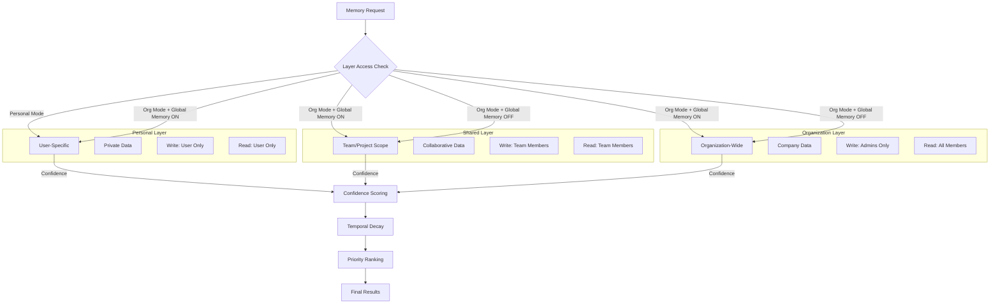
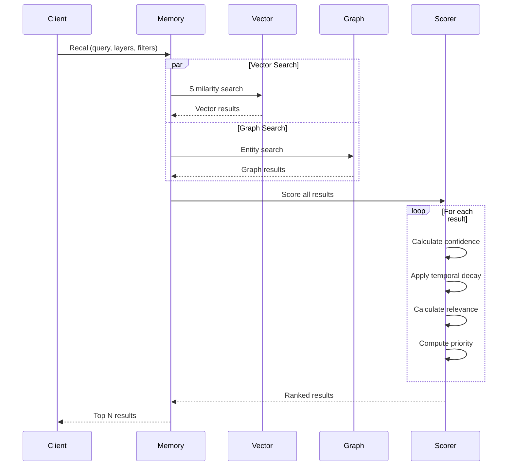
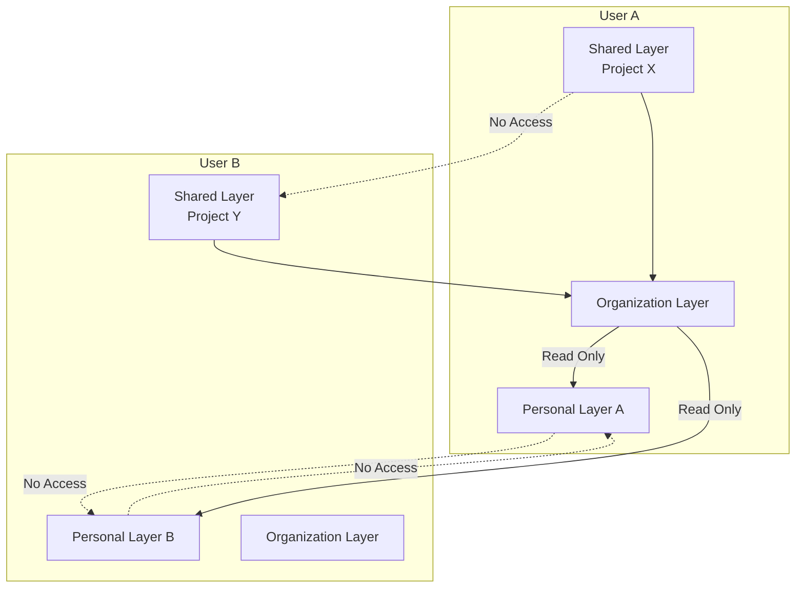

# Memory System Documentation

## Overview

NeuroGraph implements a three-layer memory architecture designed to provide isolated, scoped, and global knowledge storage. The system combines confidence scoring, temporal decay, and layer-specific access control to deliver relevant, trustworthy information retrieval.

## Three-Layer Architecture



### Layer Characteristics

| Layer | Scope | Write Access | Read Access | Use Case |
|-------|-------|--------------|-------------|----------|
| **Personal** | User-specific | User only | User only | Personal notes, preferences, private context |
| **Shared** | Team/project | Team members | Team members | Project documentation, team decisions, collaborative work |
| **Organization** | Company-wide | Admins only | All org members | Company policies, public announcements, shared resources |

## Read Priority Logic

### Priority Calculation Formula

```
Priority Score = (Confidence Score × 0.5) + (Temporal Score × 0.2) + (Relevance Score × 0.3)

Where:
- Confidence Score: 0.0 to 1.0 (model-assigned confidence)
- Temporal Score: 0.0 to 1.0 (recency-based decay)
- Relevance Score: 0.0 to 1.0 (semantic similarity)
```

### Layer Priority

When Global Memory is enabled, results from multiple layers are merged:

1. **Exact Matches**: Highest priority regardless of layer
2. **High Confidence (>0.9)**: Prioritized across all layers
3. **Recent (<7 days)**: Boosted temporal score
4. **Personal Layer**: Slight boost (+0.05) when in General mode
5. **Shared Layer**: Slight boost (+0.05) when in Organization mode

### Read Flow Diagram



## Write Rules Per Layer

### Personal Layer

**Write Conditions**:
- User must be authenticated
- User owns the memory
- No approval required

**Operations**:
```python
# Write to personal layer
await memory.remember(
    content="My personal note",
    layer="personal",
    user_id=current_user.id
)

# Only accessible by the same user
results = await memory.recall(
    query="personal note",
    layers=["personal"],
    user_id=current_user.id
)
```

**Validation Rules**:
- Content must be non-empty
- User ID must match authenticated user
- No cross-user access permitted

### Shared Layer

**Write Conditions**:
- User must be team/project member
- Project/team must exist
- User has write permissions

**Operations**:
```python
# Write to shared layer
await memory.remember(
    content="Team decision: Use React for frontend",
    layer="shared",
    user_id=current_user.id,
    scope_id="project_123"  # Project or team ID
)

# Accessible by all team members
results = await memory.recall(
    query="frontend decision",
    layers=["shared"],
    scope_id="project_123"
)
```

**Validation Rules**:
- Scope ID (project/team) required
- User must be member of scope
- Content must be relevant to scope

### Organization Layer

**Write Conditions**:
- User must have admin role
- Organization must exist
- Content must be approved (if policy requires)

**Operations**:
```python
# Write to organization layer (admin only)
await memory.remember(
    content="Company policy: Remote work allowed",
    layer="organization",
    user_id=admin_user.id,
    organization_id="org_123"
)

# Accessible by all organization members
results = await memory.recall(
    query="remote work policy",
    layers=["organization"],
    organization_id="org_123"
)
```

**Validation Rules**:
- User must have admin role
- Organization ID required
- May require approval workflow
- Audit logging enabled

## Confidence Scoring Algorithm

### Confidence Score Components

```python
def calculate_confidence(memory: Memory) -> float:
    """
    Calculate confidence score for a memory.
    
    Factors:
    1. Source reliability (0.0 - 1.0)
    2. Entity extraction quality (0.0 - 1.0)
    3. Relationship clarity (0.0 - 1.0)
    4. Validation status (0.0 - 1.0)
    5. User feedback (0.0 - 1.0)
    """
    
    # Source reliability
    source_scores = {
        "user_input": 0.8,
        "webhook": 0.9,
        "mcp_tool": 0.95,
        "api": 0.85
    }
    source_score = source_scores.get(memory.source, 0.7)
    
    # Entity extraction quality
    entity_score = 0.0
    if memory.entities_extracted > 0:
        # Higher score for more entities with properties
        entity_score = min(
            1.0,
            (memory.entities_extracted * 0.2) + 
            (memory.entities_with_properties * 0.1)
        )
    
    # Relationship clarity
    relationship_score = 0.0
    if memory.relationships_created > 0:
        # Score based on relationship completeness
        relationship_score = min(
            1.0,
            memory.relationships_created * 0.15
        )
    
    # Validation status
    validation_score = 0.0
    if memory.validated:
        validation_score = 1.0
    elif memory.validation_pending:
        validation_score = 0.5
    
    # User feedback
    feedback_score = 0.5  # Default neutral
    if memory.user_feedback:
        feedback_score = memory.user_feedback.score
    
    # Weighted average
    confidence = (
        source_score * 0.25 +
        entity_score * 0.20 +
        relationship_score * 0.15 +
        validation_score * 0.20 +
        feedback_score * 0.20
    )
    
    return round(confidence, 3)
```

### Confidence Levels

| Range | Level | Interpretation |
|-------|-------|----------------|
| 0.90 - 1.00 | Very High | Validated, reliable information |
| 0.75 - 0.89 | High | Good quality, trustworthy |
| 0.60 - 0.74 | Medium | Acceptable, may need verification |
| 0.40 - 0.59 | Low | Questionable, use with caution |
| 0.00 - 0.39 | Very Low | Unreliable, likely incorrect |

### Confidence Adjustment

Confidence scores can be adjusted based on:

1. **User Feedback**: Upvote (+0.05), Downvote (-0.10)
2. **Validation**: Manual validation (+0.15)
3. **Contradictions**: Conflicting information (-0.20)
4. **Confirmations**: Multiple sources agree (+0.10)

## Temporal Decay Formula

### Decay Function

```python
import math
from datetime import datetime, timedelta

def calculate_temporal_score(created_at: datetime, decay_days: int = 365) -> float:
    """
    Calculate temporal score with exponential decay.
    
    Score decreases over time, with half-life at decay_days/2.
    """
    age_days = (datetime.utcnow() - created_at).days
    
    if age_days < 0:
        return 1.0  # Future date, full score
    
    # Exponential decay: score = e^(-λt)
    # λ is decay constant based on desired half-life
    half_life_days = decay_days / 2
    decay_constant = math.log(2) / half_life_days
    
    score = math.exp(-decay_constant * age_days)
    
    # Boost recent memories
    if age_days <= 7:
        score = min(1.0, score * 1.2)  # 20% boost for last week
    elif age_days <= 30:
        score = min(1.0, score * 1.1)  # 10% boost for last month
    
    return round(score, 3)
```

### Temporal Decay Curve

```
Score
1.0 |●
    |  ●●
0.9 |    ●●
    |      ●●
0.8 |        ●●
    |          ●●●
0.7 |             ●●●
    |                ●●●
0.6 |                   ●●●
    |                      ●●●●
0.5 |________________________●●●●
    0   30   60   90  120  150  180 (days)
```

### Configurable Decay Parameters

| Layer | Default Decay Days | Half-Life | Minimum Score |
|-------|-------------------|-----------|---------------|
| **Personal** | 365 | 182 days | 0.1 |
| **Shared** | 180 | 90 days | 0.2 |
| **Organization** | 730 | 365 days | 0.3 |

## Layer Isolation Guarantees

### Security Boundaries



### Access Control Matrix

| User Role | Personal Layer | Shared Layer | Organization Layer |
|-----------|---------------|--------------|-------------------|
| **Regular User** | Read/Write (own) | Read/Write (member) | Read only |
| **Team Lead** | Read/Write (own) | Read/Write (team) | Read only |
| **Admin** | Read/Write (all) | Read/Write (all) | Read/Write |
| **Anonymous** | No access | No access | No access |

### Enforcement Mechanisms

```python
async def check_layer_access(
    user_id: str,
    layer: str,
    operation: str,  # "read" or "write"
    scope_id: str = None,
    organization_id: str = None
) -> bool:
    """
    Enforce layer isolation and access control.
    """
    
    if layer == "personal":
        # Personal layer: user can only access own data
        if operation == "read" or operation == "write":
            return True  # Already filtered by user_id in query
        return False
    
    elif layer == "shared":
        # Shared layer: check team/project membership
        if not scope_id:
            raise ValueError("scope_id required for shared layer")
        
        is_member = await check_membership(user_id, scope_id)
        if not is_member:
            return False
        
        if operation == "write":
            # Check write permissions
            return await check_write_permission(user_id, scope_id)
        
        return True
    
    elif layer == "organization":
        # Organization layer: check org membership and role
        if not organization_id:
            raise ValueError("organization_id required for org layer")
        
        is_member = await check_org_membership(user_id, organization_id)
        if not is_member:
            return False
        
        if operation == "write":
            # Only admins can write
            return await check_admin_role(user_id, organization_id)
        
        return True
    
    return False
```

### Data Isolation SQL Queries

```sql
-- Personal layer: row-level security
CREATE POLICY personal_isolation ON memories
    FOR ALL
    TO authenticated_users
    USING (layer = 'personal' AND user_id = current_user_id());

-- Shared layer: scope-based isolation
CREATE POLICY shared_isolation ON memories
    FOR ALL
    TO authenticated_users
    USING (
        layer = 'shared' AND 
        scope_id IN (
            SELECT scope_id FROM memberships 
            WHERE user_id = current_user_id()
        )
    );

-- Organization layer: read access for all members
CREATE POLICY org_read ON memories
    FOR SELECT
    TO authenticated_users
    USING (
        layer = 'organization' AND
        organization_id IN (
            SELECT organization_id FROM org_members
            WHERE user_id = current_user_id()
        )
    );

-- Organization layer: write access for admins only
CREATE POLICY org_write ON memories
    FOR INSERT
    TO authenticated_users
    WITH CHECK (
        layer = 'organization' AND
        EXISTS (
            SELECT 1 FROM org_members
            WHERE user_id = current_user_id()
            AND organization_id = memories.organization_id
            AND role = 'admin'
        )
    );
```

## Memory Manager Implementation

```python
# app/core/memory-manager.py
from typing import List, Dict, Any, Optional
from datetime import datetime

class MemoryManager:
    """
    Central memory management system.
    """
    
    def __init__(
        self,
        neo4j_service,
        postgres_service,
        redis_service,
        llm_service,
        embedding_service
    ):
        self.neo4j = neo4j_service
        self.postgres = postgres_service
        self.redis = redis_service
        self.llm = llm_service
        self.embedding = embedding_service
    
    async def remember(
        self,
        content: str,
        layer: str,
        user_id: str,
        scope_id: Optional[str] = None,
        organization_id: Optional[str] = None,
        metadata: Optional[Dict[str, Any]] = None
    ) -> Dict[str, Any]:
        """
        Store information in the memory system.
        """
        # Validate layer access
        if not await self._check_write_access(
            user_id, layer, scope_id, organization_id
        ):
            raise PermissionError(f"No write access to {layer} layer")
        
        # Generate embedding
        embedding = await self.embedding.generate(content)
        
        # Extract entities (using LLM)
        entities = await self._extract_entities(content)
        
        # Store in PostgreSQL
        memory_id = await self.postgres.insert_memory(
            content=content,
            embedding=embedding,
            layer=layer,
            user_id=user_id,
            scope_id=scope_id,
            organization_id=organization_id,
            metadata=metadata
        )
        
        # Store entities in Neo4j
        for entity in entities:
            await self.neo4j.create_entity(
                name=entity["name"],
                entity_type=entity["type"],
                properties=entity["properties"],
                layer=layer
            )
        
        # Calculate confidence
        confidence = await self._calculate_confidence(memory_id)
        
        # Cache frequently accessed memories
        await self.redis.set(
            f"memory:{memory_id}",
            {"content": content, "confidence": confidence},
            ex=300  # 5 minute TTL
        )
        
        return {
            "id": memory_id,
            "entities_extracted": len(entities),
            "confidence": confidence,
            "layer": layer
        }
    
    async def recall(
        self,
        query: str,
        layers: List[str],
        user_id: str,
        max_results: int = 10,
        min_confidence: float = 0.5,
        temporal_weight: float = 0.2,
        scope_id: Optional[str] = None,
        organization_id: Optional[str] = None
    ) -> List[Dict[str, Any]]:
        """
        Retrieve information from memory.
        """
        # Check cache first
        cache_key = f"recall:{hash(query)}:{','.join(layers)}"
        cached = await self.redis.get(cache_key)
        if cached:
            return cached
        
        # Generate query embedding
        query_embedding = await self.embedding.generate(query)
        
        # Search vector store
        vector_results = await self.postgres.vector_search(
            embedding=query_embedding,
            layers=layers,
            user_id=user_id,
            scope_id=scope_id,
            organization_id=organization_id,
            limit=max_results * 2  # Get more for ranking
        )
        
        # Score and rank results
        ranked_results = []
        for result in vector_results:
            confidence = result["confidence"]
            temporal = calculate_temporal_score(result["created_at"])
            relevance = result["similarity_score"]
            
            priority = (
                confidence * 0.5 +
                temporal * temporal_weight +
                relevance * (1.0 - temporal_weight - 0.5)
            )
            
            if confidence >= min_confidence:
                ranked_results.append({
                    **result,
                    "priority_score": priority
                })
        
        # Sort by priority
        ranked_results.sort(key=lambda x: x["priority_score"], reverse=True)
        
        # Return top N
        final_results = ranked_results[:max_results]
        
        # Cache results
        await self.redis.set(cache_key, final_results, ex=60)
        
        return final_results
```

## Memory Statistics

Track memory system metrics:

```python
class MemoryStats:
    async def get_layer_statistics(
        self, 
        layer: str,
        user_id: str = None,
        organization_id: str = None
    ) -> Dict[str, Any]:
        """
        Get statistics for a memory layer.
        """
        return {
            "total_memories": await self._count_memories(layer),
            "avg_confidence": await self._avg_confidence(layer),
            "entities_count": await self._count_entities(layer),
            "relationships_count": await self._count_relationships(layer),
            "age_distribution": await self._age_distribution(layer),
            "confidence_distribution": await self._confidence_distribution(layer)
        }
```

## Related Documentation

- [Architecture](./architecture.md) - Memory system architecture
- [Graph](./graph.md) - Graph storage for entities and relationships
- [RAG](./rag.md) - RAG pipeline using memory system
- [Databases](./databases.md) - PostgreSQL and Neo4j configuration
