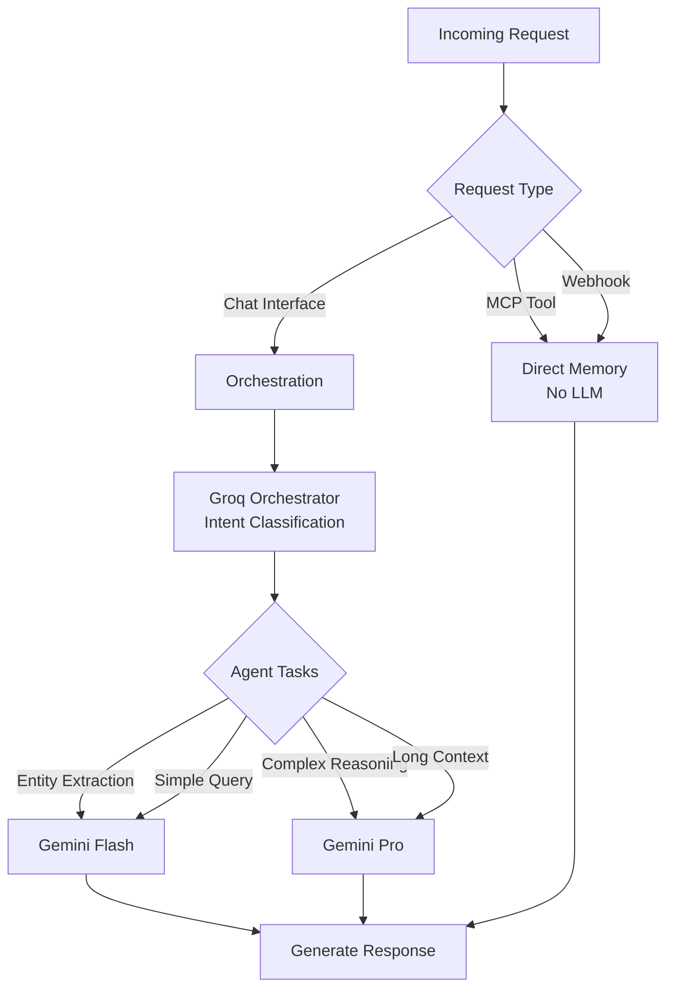

# LLM Integration Documentation

## Overview

NeuroGraph integrates two primary LLM providers:

- **Google Gemini**: Primary LLM for processing, embeddings, and response generation
- **Groq (Llama 3.3 70B)**: Orchestrator for intent classification and agent selection

Each model is selected based on specific criteria optimized for performance, cost, and capabilities.

## Gemini API Usage

### Configuration

```python
# app/config.py
GEMINI_API_KEY = os.getenv("GEMINI_API_KEY")
GEMINI_MODEL_FLASH = "gemini-1.5-flash"  # Fast, cost-effective
GEMINI_MODEL_PRO = "gemini-1.5-pro"      # Advanced reasoning
GEMINI_EMBEDDING_MODEL = "models/embedding-001"  # 768-dimensional embeddings
```

### Gemini Service

```python
# app/services/llm-service.py
import google.generativeai as genai
from typing import Dict, List, Any, Optional

class GeminiService:
    def __init__(self, api_key: str):
        genai.configure(api_key=api_key)
        
        # Initialize models
        self.flash = genai.GenerativeModel('gemini-1.5-flash')
        self.pro = genai.GenerativeModel('gemini-1.5-pro')
        
        # Configure generation settings
        self.generation_config = {
            'temperature': 0.7,
            'top_p': 0.95,
            'top_k': 40,
            'max_output_tokens': 2048,
        }
        
        # Safety settings
        self.safety_settings = [
            {
                "category": "HARM_CATEGORY_HARASSMENT",
                "threshold": "BLOCK_MEDIUM_AND_ABOVE"
            },
            {
                "category": "HARM_CATEGORY_HATE_SPEECH",
                "threshold": "BLOCK_MEDIUM_AND_ABOVE"
            }
        ]
    
    async def generate(
        self,
        prompt: str,
        model: str = "flash",
        temperature: float = None,
        max_tokens: int = None
    ) -> str:
        """
        Generate text using Gemini.
        """
        # Select model
        selected_model = self.flash if model == "flash" else self.pro
        
        # Override config if provided
        config = self.generation_config.copy()
        if temperature is not None:
            config['temperature'] = temperature
        if max_tokens is not None:
            config['max_output_tokens'] = max_tokens
        
        # Generate
        response = selected_model.generate_content(
            prompt,
            generation_config=config,
            safety_settings=self.safety_settings
        )
        
        return response.text
    
    async def chat(
        self,
        messages: List[Dict[str, str]],
        model: str = "flash"
    ) -> str:
        """
        Chat-based generation with conversation history.
        """
        selected_model = self.flash if model == "flash" else self.pro
        
        # Start chat
        chat = selected_model.start_chat(history=[])
        
        # Process messages
        for msg in messages[:-1]:  # All except last
            if msg['role'] == 'user':
                chat.send_message(msg['content'])
        
        # Send final message and get response
        response = chat.send_message(messages[-1]['content'])
        
        return response.text
    
    async def extract_entities(self, text: str) -> List[Dict[str, Any]]:
        """
        Extract entities from text using Gemini.
        """
        prompt = f"""Extract entities from the following text. Identify:
- People (name, role, attributes)
- Projects (name, status, description)
- Organizations (name, type)
- Events (name, date, location)
- Documents (title, type)

Text: {text}

Return JSON array:
[
  {{"name": "Entity Name", "type": "person", "properties": {{}}}},
  ...
]

Return only valid JSON, no explanation."""
        
        response = await self.generate(prompt, model="flash", temperature=0.3)
        
        try:
            import json
            entities = json.loads(response)
            return entities
        except json.JSONDecodeError:
            return []
    
    async def summarize(
        self,
        text: str,
        max_length: int = 200
    ) -> str:
        """
        Generate summary of text.
        """
        prompt = f"""Summarize the following text in {max_length} words or less.

Text: {text}

Summary:"""
        
        return await self.generate(prompt, model="flash", temperature=0.5)
    
    async def function_calling(
        self,
        prompt: str,
        functions: List[Dict[str, Any]]
    ) -> Dict[str, Any]:
        """
        Use Gemini function calling.
        """
        tools = [{"function_declarations": functions}]
        
        response = self.flash.generate_content(
            prompt,
            tools=tools,
            generation_config=self.generation_config
        )
        
        # Extract function call
        if response.candidates[0].content.parts:
            function_call = response.candidates[0].content.parts[0].function_call
            return {
                "name": function_call.name,
                "arguments": dict(function_call.args)
            }
        
        return None
```

### Gemini Flash vs Pro

| Model | Use Case | Latency | Cost | Token Limit |
|-------|----------|---------|------|-------------|
| **Flash** | Quick responses, entity extraction, summaries | Low (300-800ms) | Low | 1M tokens |
| **Pro** | Complex reasoning, deep analysis, long context | Medium (1-3s) | Higher | 2M tokens |

### Gemini Embeddings

```python
# app/services/embedding-service.py
import google.generativeai as genai

class GeminiEmbeddingService:
    def __init__(self, api_key: str):
        genai.configure(api_key=api_key)
        self.model = "models/embedding-001"
        self.dimension = 768
    
    async def embed_text(
        self,
        text: str,
        task_type: str = "retrieval_document"
    ) -> List[float]:
        """
        Generate embedding for text.
        
        Task types:
        - retrieval_document: For storing documents
        - retrieval_query: For search queries
        - semantic_similarity: For similarity comparison
        - classification: For classification tasks
        """
        result = genai.embed_content(
            model=self.model,
            content=text,
            task_type=task_type
        )
        return result['embedding']
    
    async def embed_batch(
        self,
        texts: List[str],
        task_type: str = "retrieval_document"
    ) -> List[List[float]]:
        """
        Generate embeddings for multiple texts.
        """
        embeddings = []
        
        # Process in batches of 100
        batch_size = 100
        for i in range(0, len(texts), batch_size):
            batch = texts[i:i + batch_size]
            
            for text in batch:
                embedding = await self.embed_text(text, task_type)
                embeddings.append(embedding)
        
        return embeddings
```

## Groq API Usage

### Configuration

```python
# app/config.py
GROQ_API_KEY = os.getenv("GROQ_API_KEY")
GROQ_MODEL = "llama-3.3-70b-versatile"
```

### Groq Service for Orchestration

```python
# app/services/groq-service.py
from groq import AsyncGroq
from typing import Dict, List, Any
import json

class GroqService:
    def __init__(self, api_key: str, model: str = "llama-3.3-70b-versatile"):
        self.client = AsyncGroq(api_key=api_key)
        self.model = model
    
    async def classify_intent(
        self,
        message: str,
        conversation_history: List[Dict[str, str]] = None
    ) -> Dict[str, Any]:
        """
        Classify user intent for orchestration.
        """
        system_prompt = """You are an intent classifier for NeuroGraph.

Classify user messages into:
- write: Store/remember information
- read: Retrieve specific information
- search: Discover/explore information
- graph: Analyze relationships
- mixed: Multiple operations

Return JSON with:
{
  "intent": "intent_name",
  "confidence": 0.0-1.0,
  "entities": ["entity1", "entity2"],
  "parallel_execution": true/false,
  "sub_tasks": [
    {"agent": "agent_type", "query": "...", "params": {...}}
  ]
}"""
        
        messages = [
            {"role": "system", "content": system_prompt}
        ]
        
        if conversation_history:
            messages.extend(conversation_history[-3:])
        
        messages.append({
            "role": "user",
            "content": f"Classify this message: {message}"
        })
        
        response = await self.client.chat.completions.create(
            model=self.model,
            messages=messages,
            response_format={"type": "json_object"},
            temperature=0.3,
            max_tokens=500
        )
        
        result = json.loads(response.choices[0].message.content)
        return result
    
    async def select_agents(
        self,
        intent: str,
        message: str,
        context: Dict[str, Any]
    ) -> List[Dict[str, Any]]:
        """
        Select and configure agents based on intent.
        """
        prompt = f"""Given this intent and message, determine which agents to spawn.

Intent: {intent}
Message: {message}
Context: {json.dumps(context)}

Available agents:
- write: Store information
- read: Retrieve information
- search: Discover information
- graph: Analyze relationships
- integration: Process external data

Return JSON array:
[
  {{
    "agent": "agent_type",
    "priority": 1-10,
    "params": {{"key": "value"}},
    "depends_on": ["agent_id"]
  }}
]"""
        
        response = await self.client.chat.completions.create(
            model=self.model,
            messages=[{"role": "user", "content": prompt}],
            response_format={"type": "json_object"},
            temperature=0.2,
            max_tokens=1000
        )
        
        result = json.loads(response.choices[0].message.content)
        return result.get("agents", [])
```

### Why Groq for Orchestration

| Aspect | Groq Advantage |
|--------|----------------|
| **Latency** | 200-500ms (vs 800-1500ms for Gemini) |
| **Cost** | Lower cost per token |
| **Structured Output** | Excellent JSON formatting |
| **Intent Classification** | High accuracy for classification tasks |
| **Throughput** | High requests/second capacity |

## Model Selection Criteria

### Decision Matrix



### Selection Rules

```python
def select_model(
    task_type: str,
    context_length: int,
    requires_reasoning: bool,
    latency_critical: bool
) -> str:
    """
    Select appropriate model based on task requirements.
    """
    # Orchestration always uses Groq
    if task_type == "orchestration":
        return "groq"
    
    # Embeddings always use Gemini Embeddings
    if task_type == "embedding":
        return "gemini-embedding"
    
    # For Gemini tasks, choose Flash vs Pro
    if task_type in ["generation", "extraction", "summary"]:
        # Use Pro for complex reasoning or long context
        if requires_reasoning or context_length > 50000:
            return "gemini-pro"
        
        # Use Flash for speed-critical or simple tasks
        if latency_critical or not requires_reasoning:
            return "gemini-flash"
        
        # Default to Flash
        return "gemini-flash"
    
    return "gemini-flash"
```

## Function Calling Examples

### Gemini Function Calling

```python
# Define function schema
memory_functions = [
    {
        "name": "remember_information",
        "description": "Store information in memory",
        "parameters": {
            "type": "object",
            "properties": {
                "content": {
                    "type": "string",
                    "description": "Information to remember"
                },
                "layer": {
                    "type": "string",
                    "enum": ["personal", "shared", "organization"],
                    "description": "Memory layer"
                }
            },
            "required": ["content", "layer"]
        }
    },
    {
        "name": "recall_information",
        "description": "Retrieve information from memory",
        "parameters": {
            "type": "object",
            "properties": {
                "query": {
                    "type": "string",
                    "description": "Search query"
                },
                "max_results": {
                    "type": "integer",
                    "description": "Maximum number of results"
                }
            },
            "required": ["query"]
        }
    }
]

# Use with Gemini
async def process_with_functions(user_message: str):
    response = await gemini_service.function_calling(
        prompt=user_message,
        functions=memory_functions
    )
    
    if response:
        function_name = response["name"]
        arguments = response["arguments"]
        
        # Execute function
        if function_name == "remember_information":
            result = await memory.remember(
                content=arguments["content"],
                layer=arguments["layer"]
            )
        elif function_name == "recall_information":
            result = await memory.recall(
                query=arguments["query"],
                max_results=arguments.get("max_results", 10)
            )
        
        return result
```

## Error Handling

### Retry Strategy

```python
import asyncio
from tenacity import (
    retry,
    stop_after_attempt,
    wait_exponential,
    retry_if_exception_type
)

class LLMError(Exception):
    pass

class RateLimitError(LLMError):
    pass

class APIError(LLMError):
    pass

@retry(
    stop=stop_after_attempt(3),
    wait=wait_exponential(multiplier=1, min=1, max=10),
    retry=retry_if_exception_type((RateLimitError, APIError))
)
async def generate_with_retry(
    llm_service,
    prompt: str,
    **kwargs
) -> str:
    """
    Generate with automatic retry on failures.
    """
    try:
        return await llm_service.generate(prompt, **kwargs)
    except Exception as e:
        if "rate limit" in str(e).lower():
            raise RateLimitError(str(e))
        elif "api error" in str(e).lower():
            raise APIError(str(e))
        else:
            raise LLMError(str(e))
```

### Fallback Strategy

```python
async def generate_with_fallback(
    prompt: str,
    prefer_model: str = "flash"
) -> str:
    """
    Generate with fallback to alternative model.
    """
    try:
        # Try primary model
        if prefer_model == "flash":
            return await gemini_service.generate(prompt, model="flash")
        else:
            return await gemini_service.generate(prompt, model="pro")
    except Exception as e:
        logger.warning(f"Primary model failed: {e}. Trying fallback.")
        
        try:
            # Fallback to alternative
            if prefer_model == "flash":
                return await gemini_service.generate(prompt, model="pro")
            else:
                return await gemini_service.generate(prompt, model="flash")
        except Exception as e2:
            logger.error(f"Fallback model failed: {e2}")
            raise
```

## Rate Limiting

### Rate Limit Configuration

| Provider | Tier | Requests/Minute | Tokens/Minute |
|----------|------|-----------------|---------------|
| **Gemini Flash** | Free | 15 | 1M |
| **Gemini Flash** | Paid | 1000 | 4M |
| **Gemini Pro** | Free | 2 | 32K |
| **Gemini Pro** | Paid | 1000 | 4M |
| **Groq** | Free | 30 | 14.4K |
| **Groq** | Paid | 500 | 1M |

### Rate Limiter Implementation

```python
# app/utils/rate-limiter.py
import asyncio
from collections import deque
from datetime import datetime, timedelta

class RateLimiter:
    def __init__(self, max_requests: int, window_seconds: int = 60):
        self.max_requests = max_requests
        self.window_seconds = window_seconds
        self.requests = deque()
        self.lock = asyncio.Lock()
    
    async def acquire(self):
        """
        Wait if rate limit would be exceeded.
        """
        async with self.lock:
            now = datetime.utcnow()
            cutoff = now - timedelta(seconds=self.window_seconds)
            
            # Remove old requests
            while self.requests and self.requests[0] < cutoff:
                self.requests.popleft()
            
            # Check limit
            if len(self.requests) >= self.max_requests:
                # Calculate wait time
                oldest = self.requests[0]
                wait_until = oldest + timedelta(seconds=self.window_seconds)
                wait_seconds = (wait_until - now).total_seconds()
                
                if wait_seconds > 0:
                    await asyncio.sleep(wait_seconds)
                    return await self.acquire()
            
            # Record request
            self.requests.append(now)

# Usage
gemini_limiter = RateLimiter(max_requests=15, window_seconds=60)

async def rate_limited_generate(prompt: str):
    await gemini_limiter.acquire()
    return await gemini_service.generate(prompt)
```

## Token Usage Tracking

```python
# app/utils/token-tracker.py
class TokenTracker:
    def __init__(self):
        self.usage = {
            "gemini_flash": {"input": 0, "output": 0},
            "gemini_pro": {"input": 0, "output": 0},
            "groq": {"input": 0, "output": 0}
        }
    
    def track(
        self,
        model: str,
        input_tokens: int,
        output_tokens: int
    ):
        """
        Track token usage by model.
        """
        if model not in self.usage:
            self.usage[model] = {"input": 0, "output": 0}
        
        self.usage[model]["input"] += input_tokens
        self.usage[model]["output"] += output_tokens
    
    def get_usage(self) -> Dict[str, Any]:
        """
        Get total token usage.
        """
        return self.usage
    
    def estimate_cost(self) -> float:
        """
        Estimate cost based on token usage.
        """
        # Pricing (per 1M tokens)
        prices = {
            "gemini_flash": {"input": 0.075, "output": 0.30},
            "gemini_pro": {"input": 1.25, "output": 5.00},
            "groq": {"input": 0.05, "output": 0.10}
        }
        
        total_cost = 0.0
        for model, tokens in self.usage.items():
            if model in prices:
                input_cost = (tokens["input"] / 1_000_000) * prices[model]["input"]
                output_cost = (tokens["output"] / 1_000_000) * prices[model]["output"]
                total_cost += input_cost + output_cost
        
        return total_cost
```

## Best Practices

### Prompt Engineering

```python
# Good: Specific, structured prompt
good_prompt = """Extract entities from this text.

Text: "John Doe is working on Project Alpha with Sarah."

Format:
- Person: [names]
- Project: [names]

Output:"""

# Bad: Vague, unstructured prompt
bad_prompt = "Find stuff in this text: John Doe is working on Project Alpha with Sarah."
```

### Temperature Settings

| Task | Temperature | Reasoning |
|------|-------------|-----------|
| **Entity Extraction** | 0.1-0.3 | Deterministic, structured output |
| **Classification** | 0.2-0.4 | Consistent categorization |
| **Creative Writing** | 0.7-0.9 | Diverse, engaging output |
| **Summarization** | 0.5-0.7 | Balance accuracy and readability |
| **Q&A** | 0.3-0.5 | Factual but natural |

### Context Window Management

```python
def truncate_context(
    context: str,
    max_tokens: int,
    preserve_recent: bool = True
) -> str:
    """
    Truncate context to fit within token limit.
    """
    estimated_tokens = len(context) // 4
    
    if estimated_tokens <= max_tokens:
        return context
    
    # Calculate target length
    target_length = max_tokens * 4
    
    if preserve_recent:
        # Keep end of context (most recent)
        return "..." + context[-target_length:]
    else:
        # Keep beginning of context
        return context[:target_length] + "..."
```

## Related Documentation

- [RAG](./rag.md) - LLM usage in RAG pipeline
- [Agents](./agents.md) - LLM usage in agent system
- [Architecture](./architecture.md) - Model selection architecture
- [Backend](./backend.md) - LLM service implementation
