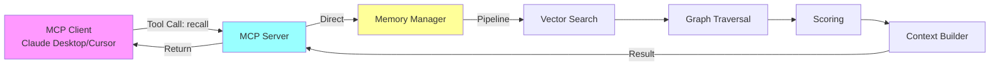
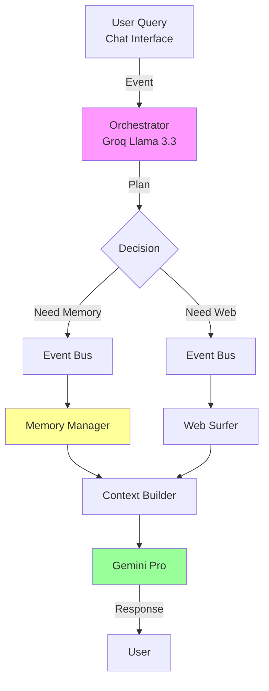
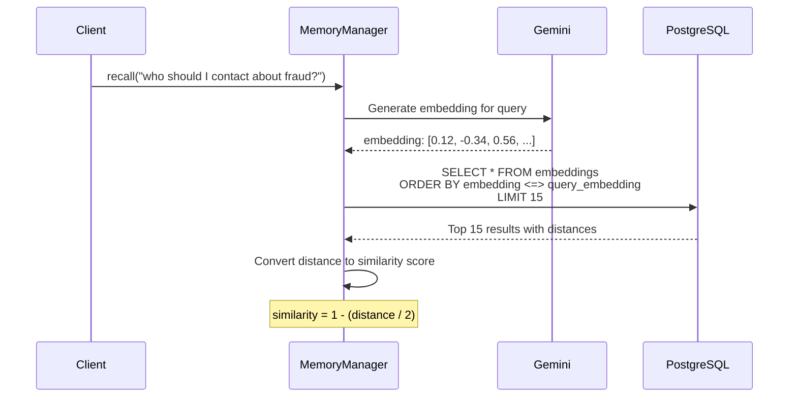
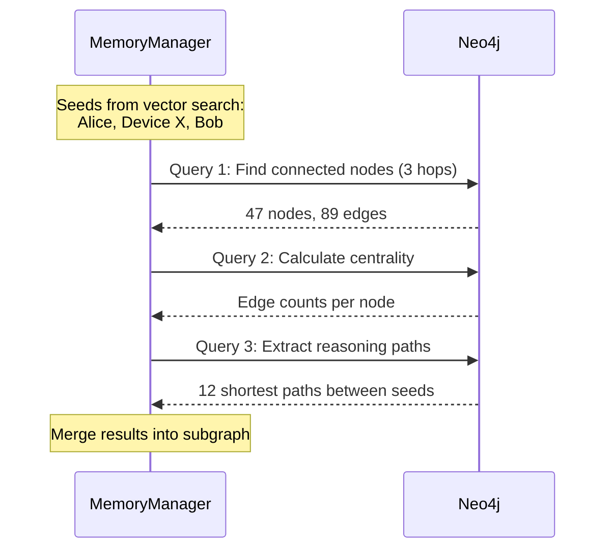

# NeuroGraph Pipeline

**Complete Hybrid Vector + Graph Retrieval Pipeline**

## Table of Contents

1. [Overview](#overview)
2. [Two Distinct Paths](#two-distinct-paths)
3. [Vector Store vs Graph Database](#vector-store-vs-graph-database)
4. [Full Pipeline Diagram](#full-pipeline-diagram)
5. [Stage 1: Vector Search](#stage-1-vector-search)
6. [Stage 2: Graph Traversal](#stage-2-graph-traversal)
7. [Stage 3: Hybrid Scoring](#stage-3-hybrid-scoring)
8. [Stage 4: Context Assembly](#stage-4-context-assembly)
9. [Stage 5: LLM Generation](#stage-5-llm-generation)
10. [Technical Implementation](#technical-implementation)
11. [Performance Characteristics](#performance-characteristics)

---

## Overview

NeuroGraph implements a hybrid retrieval system that combines:
- **Vector similarity search** (pgvector) for semantic matching
- **Graph traversal** (Neo4j) for structural reasoning
- **Weighted scoring** to rank results
- **Token-budgeted context assembly** for LLM consumption

This pipeline is NOT a simple RAG system. It makes deliberate architectural decisions:

1. **Vector search finds entry points** - semantically relevant nodes
2. **Graph traversal expands context** - structurally connected nodes
3. **Hybrid scoring ranks everything** - combining semantic + structural + temporal signals
4. **Context builder assembles prompts** - respecting token budgets and relevance

---

## Two Distinct Paths

### Path 1: MCP Clients (Direct Access)



**Key Characteristics:**
- No orchestrator involved
- Direct tool execution
- Lowest latency (< 200ms)
- MCP client decides when to call tools
- Bypasses event bus entirely

### Path 2: Chat Interface (Orchestrated)



**Key Characteristics:**
- Orchestrator plans which agents to spawn
- Can run agents in parallel
- Higher latency (< 3s end-to-end)
- Automatic memory management
- Event-driven processing

**Critical Distinction:** MCP clients are the preferred method for programmatic access. The orchestrator is only used for the chat interface where dynamic agent planning adds value.

---

## Vector Store vs Graph Database

### Architectural Separation

```
┌─────────────────────────────────────┐
│    PostgreSQL + pgvector            │
│    (Vector Store)                   │
├─────────────────────────────────────┤
│ Stores: Float[] embeddings          │
│ Search: Cosine similarity           │
│ Returns: Top-K semantically similar │
│ Speed: ~50ms for 100K vectors       │
│ Use: Entry point discovery          │
└─────────────────────────────────────┘

┌─────────────────────────────────────┐
│    Neo4j Graph Database             │
│    (Relationship Store)             │
├─────────────────────────────────────┤
│ Stores: Nodes + Edges + Properties  │
│ Search: Cypher traversal            │
│ Returns: Connected subgraph         │
│ Speed: ~100ms for 3-hop traversal   │
│ Use: Structural reasoning           │
└─────────────────────────────────────┘
```

### Why Both Are Necessary

| Task | Vector Only | Graph Only | Hybrid |
|------|-------------|------------|--------|
| "Find fraud-related nodes" | ✅ Fast semantic match | ❌ No starting point | ✅ Best of both |
| "How is Alice connected to fraud?" | ❌ No structural info | ✅ Path finding | ✅ Context + structure |
| "Why did you choose this?" | ❌ Black box similarity | ✅ Explainable paths | ✅ Full reasoning |
| "What's most important?" | ⚠️ Semantic score only | ⚠️ Centrality only | ✅ Combined signals |

**Conclusion:** Vector store is the search index. Graph database is the reasoning engine. Neither works optimally without the other.

---

## Full Pipeline Diagram

```mermaid
flowchart TD
    Start([Query: who should I contact about fraud?]) --> Embed
    
    subgraph "Stage 1: Vector Search"
        Embed[Generate Query Embedding<br/>Gemini Embeddings API] --> VectorDB[(PostgreSQL<br/>pgvector)]
        VectorDB --> VectorResults[Top 15 Semantically Similar Nodes<br/>Alice: 0.89<br/>Device X: 0.84<br/>Fraud Case 441: 0.81]
    end
    
    VectorResults --> GraphEntry
    
    subgraph "Stage 2: Graph Traversal"
        GraphEntry[Use Vector Results as Seeds] --> Neo4j[(Neo4j<br/>Graph DB)]
        Neo4j --> Cypher1[Query 1: Find Connected Nodes<br/>3-hop traversal]
        Cypher1 --> Cypher2[Query 2: Calculate Centrality<br/>Edge count per node]
        Cypher2 --> Cypher3[Query 3: Extract Reasoning Paths<br/>Shortest paths between seeds]
        Cypher3 --> GraphResults[Subgraph Results<br/>Nodes: 47<br/>Edges: 89<br/>Paths: 12]
    end
    
    GraphResults --> Merge
    
    subgraph "Stage 3: Hybrid Scoring"
        Merge[Merge Vector + Graph Data] --> Score[Calculate Composite Score<br/>semantic × 0.35<br/>hop_distance × 0.25<br/>centrality × 0.20<br/>decay × confidence × 0.20]
        Score --> Rank[Rank by Final Score<br/>Sort descending]
        Rank --> Filter[Filter: min_confidence > 0.3]
        Filter --> ScoredNodes[Scored Nodes: 32 remaining]
    end
    
    ScoredNodes --> Context
    
    subgraph "Stage 4: Context Assembly"
        Context[Token Budget Allocation<br/>Total: 4000 tokens] --> Budget1[Graph: 2000 tokens]
        Budget1 --> Budget2[Assets: 800 tokens]
        Budget2 --> Budget3[Integrations: 600 tokens]
        Budget3 --> Budget4[Web: 400 tokens]
        Budget4 --> Budget5[System: 200 tokens]
        Budget5 --> Assemble[Assemble Context String<br/>Formatted for LLM]
        Assemble --> ContextStr[Final Context<br/>3847 tokens used]
    end
    
    ContextStr --> LLM
    
    subgraph "Stage 5: LLM Generation"
        LLM[Gemini Pro] --> Prompt[Structured Prompt<br/>Context + Query]
        Prompt --> Generate[Generate Response<br/>With Citations]
        Generate --> Response([Alice leads Fraud Team<br/>confidence: 0.94<br/>source: Slack 2d ago])
    end
    
    style VectorDB fill:#e1f5ff
    style Neo4j fill:#ffe1e1
    style Score fill:#fff4e1
    style LLM fill:#e1ffe1
```



---

## Stage 1: Vector Search

### Purpose
Find semantically similar nodes using embedding-based similarity.

### Process



### Implementation

```python
async def vector_search(query: str, top_k: int = 15) -> List[VectorResult]:
    """
    Stage 1: Find semantically similar nodes using pgvector.
    
    Args:
        query: Natural language query
        top_k: Number of results to return
        
    Returns:
        List of nodes with semantic similarity scores
    """
    # Generate query embedding
    query_embedding = await gemini.embed(query)
    # 1536-dimensional vector from Gemini
    
    # pgvector cosine distance search
    sql = """
        SELECT 
            node_id,
            entity1,
            relation,
            entity2,
            embedding,
            (1 - (embedding <=> $1::vector)) / 2 AS similarity
        FROM node_embeddings
        WHERE 
            (user_id = $2 OR tenant_id = $3 OR is_global = true)
            AND deleted_at IS NULL
        ORDER BY embedding <=> $1::vector
        LIMIT $4
    """
    
    results = await db.fetch(
        sql,
        query_embedding,
        current_user_id,
        current_tenant_id,
        top_k
    )
    
    return [
        VectorResult(
            node_id=r['node_id'],
            entity1=r['entity1'],
            relation=r['relation'],
            entity2=r['entity2'],
            semantic_score=r['similarity']
        )
        for r in results
    ]
```

### Output Example

```python
[
    VectorResult(node_id="n1", entity1="Alice", relation="leads", 
                 entity2="Fraud Detection Team", semantic_score=0.89),
    VectorResult(node_id="n2", entity1="Device X", relation="linked_to",
                 entity2="Fraud Case #441", semantic_score=0.84),
    VectorResult(node_id="n3", entity1="Bob", relation="reported",
                 entity2="Device X", semantic_score=0.81),
    # ... 12 more results
]
```

### Performance

- **Latency**: 20-50ms for 100K embeddings
- **Accuracy**: Approximate (HNSW index trades exactness for speed)
- **Scalability**: Horizontal (partition by user_id hash)

---

## Stage 2: Graph Traversal

### Purpose
Expand from seed nodes to find structurally connected context.

### Process



### Implementation

```python
async def graph_traversal(seed_nodes: List[str]) -> GraphResult:
    """
    Stage 2: Traverse graph from seed nodes to find connected context.
    
    Args:
        seed_nodes: Node names from vector search
        
    Returns:
        Subgraph with nodes, edges, paths, and centrality metrics
    """
    
    # Query 1: Find everything connected within 3 hops
    connected_query = """
        MATCH path = (start)-[r*1..3]-(end)
        WHERE start.name IN $seeds
          AND (start.user_id = $user_id OR start.tenant_id = $tenant_id 
               OR start.is_global = true)
          AND start.deleted_at IS NULL
        RETURN 
            nodes(path) as nodes,
            relationships(path) as rels,
            length(path) as hops
        ORDER BY length(path)
        LIMIT 200
    """
    
    connected_results = await neo4j.run(
        connected_query,
        seeds=seed_nodes,
        user_id=current_user_id,
        tenant_id=current_tenant_id
    )
    
    # Query 2: Calculate centrality (how connected each node is)
    centrality_query = """
        MATCH (n)-[r]-(neighbor)
        WHERE n.name IN $all_nodes
        RETURN n.name as node, count(r) as edge_count
        ORDER BY edge_count DESC
    """
    
    all_nodes = extract_unique_nodes(connected_results)
    centrality_results = await neo4j.run(
        centrality_query,
        all_nodes=all_nodes
    )
    
    # Query 3: Find reasoning paths between important nodes
    path_query = """
        MATCH path = shortestPath(
            (a)-[*]-(b)
        )
        WHERE a.name IN $seeds AND b.name IN $seeds
          AND a.name < b.name  -- Avoid duplicate paths
        RETURN 
            path,
            [r in relationships(path) | r.reason] as reasons,
            [r in relationships(path) | r.confidence] as confidences,
            length(path) as length
        ORDER BY length
        LIMIT 20
    """
    
    path_results = await neo4j.run(path_query, seeds=seed_nodes)
    
    return GraphResult(
        nodes=connected_results['nodes'],
        edges=connected_results['edges'],
        centrality=centrality_results,
        paths=path_results
    )
```

### Cypher Query Examples

**Find Connected Nodes (3-hop traversal):**
```cypher
MATCH path = (start)-[r*1..3]-(end)
WHERE start.name IN ['Alice', 'Device X', 'Bob']
  AND (start.user_id = 'user-123' OR start.tenant_id = 'acme-corp' 
       OR start.is_global = true)
  AND start.deleted_at IS NULL
RETURN 
    nodes(path) as nodes,
    relationships(path) as rels,
    length(path) as hops
ORDER BY length(path)
LIMIT 200
```

**Calculate Node Centrality:**
```cypher
MATCH (n)-[r]-(neighbor)
WHERE n.name IN ['Alice', 'Device X', 'Bob', 'Fraud Team', ...]
RETURN 
    n.name as node, 
    count(r) as edge_count
ORDER BY edge_count DESC
```

**Extract Reasoning Paths:**
```cypher
MATCH path = shortestPath(
    (a {name: 'Alice'})-[*]-(b {name: 'Device X'})
)
RETURN 
    path,
    [r in relationships(path) | r.reason] as reasons,
    [r in relationships(path) | r.confidence] as confidences
```

### Output Example

```python
GraphResult(
    nodes=[
        {"name": "Alice", "hops": 0, "edge_count": 23},
        {"name": "Fraud Detection Team", "hops": 1, "edge_count": 15},
        {"name": "Device X", "hops": 1, "edge_count": 8},
        # ... 44 more nodes
    ],
    edges=[
        {"from": "Alice", "to": "Fraud Detection Team", 
         "relation": "leads", "confidence": 0.95, "reason": "Slack announcement"},
        # ... 88 more edges
    ],
    paths=[
        "Alice → leads → Fraud Team → investigated → Device X",
        "Bob → reported → Device X → linked_to → Fraud Case #441",
        # ... 10 more paths
    ]
)
```

### Performance

- **Latency**: 50-150ms for 3-hop traversal
- **Complexity**: O(n^depth) - grows exponentially with hop distance
- **Optimization**: Limit by confidence threshold, prune low-confidence branches

---

## Stage 3: Hybrid Scoring

### Purpose
Combine semantic similarity, graph structure, and temporal signals into a single relevance score.

### Scoring Algorithm

```python
def score_node(
    node: Node,
    semantic_score: float,
    hop_distance: int,
    edge_count: int,
    max_edges: int,
    age_days: int
) -> float:
    """
    Stage 3: Calculate hybrid relevance score.
    
    Scoring formula:
        final_score = (0.35 × semantic) + 
                      (0.25 × hop_score) + 
                      (0.20 × centrality) + 
                      (0.20 × decay × confidence)
    
    Args:
        node: Graph node with properties
        semantic_score: Cosine similarity from vector search (0-1)
        hop_distance: Graph distance from seed nodes (0-3)
        edge_count: Number of connections this node has
        max_edges: Maximum edge count in result set (for normalization)
        age_days: Days since node was created/updated
        
    Returns:
        Final relevance score (0-1)
    """
    
    # Component 1: Semantic similarity (from vector search)
    semantic = semantic_score  # Already 0-1
    
    # Component 2: Graph hop distance (closer is better)
    # hop 0 = 1.0, hop 1 = 0.5, hop 2 = 0.33, hop 3 = 0.25
    hop_score = 1.0 / (1.0 + hop_distance)
    
    # Component 3: Centrality (more connected = more important)
    centrality = edge_count / max_edges if max_edges > 0 else 0
    
    # Component 4: Temporal decay × confidence
    # Exponential decay: e^(-0.05 × days)
    # After 30 days: 0.22 multiplier
    # After 60 days: 0.05 multiplier
    decay = math.exp(-0.05 * age_days)
    confidence = node.confidence_score  # 0-1
    temporal = decay * confidence
    
    # Weighted combination
    final_score = (
        0.35 * semantic +      # Semantic similarity (highest weight)
        0.25 * hop_score +     # Structural proximity
        0.20 * centrality +    # Graph importance
        0.20 * temporal        # Freshness + confidence
    )
    
    return final_score
```

### Scoring Weights Rationale

| Component | Weight | Rationale |
|-----------|--------|-----------|
| Semantic similarity | 0.35 | Primary signal - what user is asking about |
| Hop distance | 0.25 | Structural relevance - closely connected nodes |
| Centrality | 0.20 | Graph importance - hub nodes are often key |
| Temporal (decay × confidence) | 0.20 | Trust signal - fresh, confident facts matter |

### Example Calculation

```python
# Node: "Alice → leads → Fraud Detection Team"
semantic_score = 0.89        # From vector search
hop_distance = 0             # Seed node from vector search
edge_count = 23              # Alice has 23 connections
max_edges = 45               # Max in result set
age_days = 2                 # Created 2 days ago
node.confidence_score = 0.95 # High confidence

# Calculate components
semantic = 0.89
hop_score = 1.0 / (1.0 + 0) = 1.0
centrality = 23 / 45 = 0.51
decay = math.exp(-0.05 * 2) = 0.90
temporal = 0.90 * 0.95 = 0.86

# Final score
final_score = (0.35 × 0.89) + (0.25 × 1.0) + (0.20 × 0.51) + (0.20 × 0.86)
            = 0.312 + 0.250 + 0.102 + 0.172
            = 0.836
```

### Implementation

```python
async def hybrid_scoring(
    vector_results: List[VectorResult],
    graph_results: GraphResult
) -> List[ScoredNode]:
    """
    Stage 3: Merge vector and graph results with hybrid scoring.
    """
    
    # Build lookup tables
    semantic_scores = {vr.node_id: vr.semantic_score for vr in vector_results}
    hop_distances = calculate_hop_distances(graph_results.nodes, vector_results)
    centrality = {c['node']: c['edge_count'] for c in graph_results.centrality}
    max_edges = max(centrality.values()) if centrality else 1
    
    scored_nodes = []
    
    for node in graph_results.nodes:
        # Get all scoring components
        semantic = semantic_scores.get(node.id, 0.0)
        hops = hop_distances.get(node.id, 3)  # Default to max distance
        edges = centrality.get(node.name, 0)
        age = (datetime.utcnow() - node.created_at).days
        
        # Calculate final score
        score = score_node(
            node=node,
            semantic_score=semantic,
            hop_distance=hops,
            edge_count=edges,
            max_edges=max_edges,
            age_days=age
        )
        
        scored_nodes.append(ScoredNode(
            node=node,
            score=score,
            semantic_score=semantic,
            hop_distance=hops,
            centrality=edges / max_edges,
            age_days=age
        ))
    
    # Sort by score descending
    scored_nodes.sort(key=lambda x: x.score, reverse=True)
    
    # Filter by minimum confidence threshold
    scored_nodes = [n for n in scored_nodes if n.node.confidence_score >= 0.3]
    
    return scored_nodes
```

### Output Example

```python
[
    ScoredNode(
        node=Node(name="Alice", relation="leads", target="Fraud Team"),
        score=0.94,
        semantic_score=0.89,
        hop_distance=0,
        centrality=0.51,
        age_days=2
    ),
    ScoredNode(
        node=Node(name="Device X", relation="linked_to", target="Fraud Case #441"),
        score=0.87,
        semantic_score=0.84,
        hop_distance=1,
        centrality=0.18,
        age_days=7
    ),
    # ... 30 more nodes, sorted by score
]
```

---

## Stage 4: Context Assembly

### Purpose
Convert scored nodes into a token-budgeted, structured context string for LLM consumption.

### Token Budget Allocation

```python
# Total context window available to NeuroGraph
TOTAL_BUDGET = 4000  # tokens

# Budget allocation by section
GRAPH_BUDGET = 2000        # Core facts from graph (50%)
ASSET_BUDGET = 800         # Linked files/documents (20%)
INTEGRATION_BUDGET = 600   # Recent Slack/GitHub/Gmail (15%)
SEARCH_BUDGET = 400        # Web search results (10%)
SYSTEM_BUDGET = 200        # System instructions (5%)
```

### Context Structure

```
┌─────────────────────────────────────────┐
│ ## Memory (2000 tokens)                 │
│ [0.94] Alice → leads → Fraud Team       │
│ [0.87] Device X → linked_to → Case #441 │
│ [0.71] Bob → reported → Device X        │
│ ... (ranked by score)                   │
├─────────────────────────────────────────┤
│ ## Reasoning Path (included in above)   │
│ Alice → leads → Fraud Team →            │
│   investigated → Device X                │
├─────────────────────────────────────────┤
│ ## Related Files (800 tokens)           │
│ - alice_contract.pdf: Summary...        │
│ - fraud_report.png: Summary...          │
├─────────────────────────────────────────┤
│ ## Recent Activity (600 tokens)         │
│ Slack (2h ago): Alice said "..."        │
│ GitHub (1d ago): PR #123 merged         │
├─────────────────────────────────────────┤
│ ## External Context (400 tokens)        │
│ [Web search results if confidence low]  │
├─────────────────────────────────────────┤
│ ## Trust Signal (minimal tokens)        │
│ Overall confidence: 81%                 │
│ 1 node below 0.5 - treat cautiously     │
└─────────────────────────────────────────┘
```

### Implementation

```python
def build_context(
    query: str,
    scored_nodes: List[ScoredNode],
    reasoning_paths: List[str],
    assets: List[Asset],
    integrations: List[Integration],
    web_results: Optional[WebSearchResult]
) -> str:
    """
    Stage 4: Assemble context string with token budget management.
    
    Returns:
        Formatted context string ready for LLM
    """
    
    sections = []
    tokens_used = 0
    
    # Section 1: Core Memory Facts
    # Estimate: ~20 tokens per node
    facts = []
    for item in scored_nodes:
        node = item.node
        score = item.score
        conf = node.confidence_score
        age = item.age_days
        
        # Format: [score] entity1 → relation → entity2 (metadata)
        line = f"[{score:.2f}] {node.entity1} → {node.relation} → {node.entity2}"
        
        # Add warnings for low confidence or old data
        warnings = []
        if conf < 0.5:
            warnings.append(f"low confidence ({conf:.2f})")
        if age > 30:
            warnings.append(f"{age}d old")
        
        if warnings:
            line += f" [{', '.join(warnings)}]"
        
        facts.append(line)
        tokens_used += estimate_tokens(line)
        
        if tokens_used >= GRAPH_BUDGET:
            break
    
    sections.append("## Memory\n" + "\n".join(facts))
    
    # Section 2: Reasoning Paths
    # Already included in token count above, just formatting
    if reasoning_paths:
        path_text = "\n".join([f"  {path}" for path in reasoning_paths[:3]])
        sections.append(f"## Reasoning Path\n{path_text}")
    
    # Section 3: Related Assets
    # Only if we have budget remaining
    if assets and tokens_used < GRAPH_BUDGET + ASSET_BUDGET:
        asset_lines = []
        asset_tokens = 0
        
        for asset in assets:
            # Use pre-generated summary (created when file uploaded)
            summary = asset.summary[:200]  # Truncate if needed
            line = f"- {asset.name}: {summary}"
            
            line_tokens = estimate_tokens(line)
            if asset_tokens + line_tokens > ASSET_BUDGET:
                break
            
            asset_lines.append(line)
            asset_tokens += line_tokens
        
        if asset_lines:
            sections.append("## Related Files\n" + "\n".join(asset_lines))
            tokens_used += asset_tokens
    
    # Section 4: Live Integrations
    # Most recent activity from Slack, GitHub, Gmail, etc.
    if integrations:
        integration_lines = []
        integration_tokens = 0
        
        for integration in sorted(integrations, key=lambda x: x.timestamp, reverse=True):
            line = f"{integration.source} ({format_relative_time(integration.timestamp)}): {integration.content}"
            
            line_tokens = estimate_tokens(line)
            if integration_tokens + line_tokens > INTEGRATION_BUDGET:
                break
            
            integration_lines.append(line)
            integration_tokens += line_tokens
        
        if integration_lines:
            sections.append("## Recent Activity\n" + "\n".join(integration_lines))
            tokens_used += integration_tokens
    
    # Section 5: Web Search Results
    # Only include if graph confidence is low
    avg_confidence = sum(n.node.confidence_score for n in scored_nodes[:10]) / 10
    
    if avg_confidence < 0.6 and web_results and tokens_used < TOTAL_BUDGET - SEARCH_BUDGET:
        web_summary = web_results.summary[:500]  # Truncate to budget
        sections.append(f"## External Context\n{web_summary}")
        tokens_used += estimate_tokens(web_summary)
    
    # Section 6: Trust Signal
    # Minimal tokens, critical information for LLM
    low_conf_count = sum(1 for n in scored_nodes if n.node.confidence_score < 0.5)
    trust_text = (
        f"## Trust Signal\n"
        f"Overall confidence: {avg_confidence:.0%}. "
        f"{low_conf_count} nodes below 0.5 - treat cautiously."
    )
    sections.append(trust_text)
    
    # Assemble final context
    context = "\n\n".join(sections)
    
    # Safety check: verify we didn't exceed budget
    actual_tokens = estimate_tokens(context)
    if actual_tokens > TOTAL_BUDGET:
        # Truncate last section if over budget
        context = truncate_to_budget(context, TOTAL_BUDGET)
    
    return context

def estimate_tokens(text: str) -> int:
    """
    Estimate token count for text.
    Rough approximation: 1 token ≈ 4 characters
    """
    return len(text) // 4

def format_relative_time(timestamp: datetime) -> str:
    """Format timestamp as relative time (2h ago, 3d ago, etc.)"""
    delta = datetime.utcnow() - timestamp
    
    if delta.days > 0:
        return f"{delta.days}d ago"
    elif delta.seconds >= 3600:
        return f"{delta.seconds // 3600}h ago"
    else:
        return f"{delta.seconds // 60}m ago"
```

### Output Example

```
## Memory
[0.94] Alice → leads → Fraud Detection Team
[0.87] Device X → linked_to → Fraud Case #441
[0.71] Bob → reported → Device X
[0.65] Fraud #441 → involves → Transaction #99
[0.58] Fraud Team → investigated → Device X
[0.43] Project X → uses → ML Model [low confidence (0.41), 62d old]

## Reasoning Path
  Alice → leads → Fraud Team → investigated → Device X
  Bob → reported → Device X → linked_to → Fraud #441

## Related Files
- alice_contract.pdf: Alice appointed as Fraud Detection Team Lead in January 2026, reports to CTO
- fraud_report.png: Dashboard showing Device X flagged in 3 separate incidents

## Recent Activity
Slack (2h ago): Alice mentioned "Device X showing up again in batch 7, investigating now"
GitHub (1d ago): PR #123 merged - Updated fraud detection threshold to 0.85

## Trust Signal
Overall confidence: 81%. 1 node below 0.5 - treat cautiously.
```

**Token Count:** 387 tokens (well within budget)

---

## Stage 5: LLM Generation

### Purpose
Generate final response using assembled context.

### Prompt Construction

```python
def construct_prompt(query: str, context: str) -> str:
    """
    Stage 5: Construct final prompt for LLM.
    """
    
    system_prompt = """You are NeuroGraph, an AI assistant with structured, explainable memory.

You have access to a knowledge graph with three layers:
- Personal: User's private memory
- Organization: Shared team knowledge  
- Global: Public world knowledge

Each fact in your memory has:
- A confidence score (0-1)
- A timestamp (age)
- A reason (why it was stored)
- A source (how it was learned)

RULES:
1. Use ONLY the context provided below
2. If confidence is low (<0.5), explicitly mention uncertainty
3. Cite specific memory nodes when making claims
4. If you don't know, say so - don't hallucinate
5. Explain your reasoning path when relevant"""

    user_prompt = f"""# Context

{context}

---

# User Question

{query}

# Instructions

Answer the question using the context above. 
Cite which memory nodes led to your conclusion.
If confidence is low, state that explicitly."""

    return system_prompt, user_prompt
```

### LLM Call

```python
async def generate_response(query: str, context: str) -> Response:
    """
    Call Gemini Pro with constructed prompt.
    """
    
    system_prompt, user_prompt = construct_prompt(query, context)
    
    response = await gemini.generate(
        model="gemini-pro",
        system=system_prompt,
        messages=[{"role": "user", "content": user_prompt}],
        temperature=0.7,
        max_tokens=1000
    )
    
    return Response(
        content=response.text,
        context_used=context,
        tokens_used=response.usage.total_tokens,
        reasoning_visible=True
    )
```

### Example Output

```
Alice leads the Fraud Detection Team (confidence: 0.94, source: Slack 2 days ago).

Based on the reasoning path in my memory:
Alice → leads → Fraud Team → investigated → Device X

This connection was established when Alice was announced as team lead in January 2026 
(source: alice_contract.pdf), and reinforced by recent activity where she mentioned 
investigating Device X again (Slack, 2 hours ago).

You should contact Alice for fraud-related issues.

Note: There's also a reference to Bob reporting Device X 3 weeks ago, suggesting he 
may have relevant context as well.
```

---

## Technical Implementation

### Complete End-to-End Code

```python
class MemoryPipeline:
    """
    Complete hybrid vector + graph retrieval pipeline.
    """
    
    def __init__(
        self,
        postgres_driver: PostgreSQLDriver,
        neo4j_driver: Neo4jDriver,
        gemini_client: GeminiClient
    ):
        self.postgres = postgres_driver
        self.neo4j = neo4j_driver
        self.gemini = gemini_client
    
    async def recall(
        self,
        query: str,
        user_id: str,
        tenant_id: Optional[str] = None,
        include_global: bool = True,
        top_k: int = 15,
        min_confidence: float = 0.3
    ) -> RecallResult:
        """
        Execute full hybrid retrieval pipeline.
        
        Args:
            query: Natural language query
            user_id: Current user ID
            tenant_id: Current tenant ID (if organization mode)
            include_global: Whether to search global layer
            top_k: Number of results from vector search
            min_confidence: Minimum confidence threshold
            
        Returns:
            RecallResult with context, nodes, reasoning paths
        """
        
        # Stage 1: Vector Search
        vector_results = await self._vector_search(
            query=query,
            user_id=user_id,
            tenant_id=tenant_id,
            include_global=include_global,
            top_k=top_k
        )
        
        # Stage 2: Graph Traversal
        seed_nodes = [vr.entity1 for vr in vector_results]
        graph_results = await self._graph_traversal(
            seed_nodes=seed_nodes,
            user_id=user_id,
            tenant_id=tenant_id,
            include_global=include_global
        )
        
        # Stage 3: Hybrid Scoring
        scored_nodes = await self._hybrid_scoring(
            vector_results=vector_results,
            graph_results=graph_results,
            min_confidence=min_confidence
        )
        
        # Extract reasoning paths
        reasoning_paths = self._extract_reasoning_paths(
            graph_results=graph_results,
            scored_nodes=scored_nodes
        )
        
        # Stage 4: Context Assembly
        context = self._build_context(
            query=query,
            scored_nodes=scored_nodes,
            reasoning_paths=reasoning_paths,
            assets=[],  # Loaded separately
            integrations=[],  # Loaded separately
            web_results=None  # Loaded by Web Surfer agent if needed
        )
        
        return RecallResult(
            context=context,
            nodes=scored_nodes,
            reasoning_paths=reasoning_paths,
            layers_used={
                "personal": sum(1 for n in scored_nodes if n.node.user_id == user_id),
                "tenant": sum(1 for n in scored_nodes if n.node.tenant_id == tenant_id),
                "global": sum(1 for n in scored_nodes if n.node.is_global)
            },
            avg_confidence=sum(n.node.confidence_score for n in scored_nodes) / len(scored_nodes),
            total_nodes_considered=len(graph_results.nodes),
            nodes_returned=len(scored_nodes)
        )
    
    async def _vector_search(self, query, user_id, tenant_id, include_global, top_k):
        """Stage 1 implementation"""
        # (See Stage 1 code above)
        pass
    
    async def _graph_traversal(self, seed_nodes, user_id, tenant_id, include_global):
        """Stage 2 implementation"""
        # (See Stage 2 code above)
        pass
    
    async def _hybrid_scoring(self, vector_results, graph_results, min_confidence):
        """Stage 3 implementation"""
        # (See Stage 3 code above)
        pass
    
    def _extract_reasoning_paths(self, graph_results, scored_nodes):
        """Extract top reasoning paths from graph results"""
        # (See Stage 2 code above)
        pass
    
    def _build_context(self, query, scored_nodes, reasoning_paths, assets, integrations, web_results):
        """Stage 4 implementation"""
        # (See Stage 4 code above)
        pass
```

### Usage in MCP Server

```python
# MCP tool: recall
@mcp_server.tool("recall")
async def mcp_recall(query: str, layers: List[str] = None, top_k: int = 15):
    """
    MCP clients call this directly - no orchestrator.
    """
    
    # Get user/tenant from MCP session
    user_id = mcp_session.user_id
    tenant_id = mcp_session.tenant_id if "tenant" in (layers or []) else None
    include_global = "global" in (layers or [])
    
    # Execute pipeline
    pipeline = MemoryPipeline(postgres, neo4j, gemini)
    result = await pipeline.recall(
        query=query,
        user_id=user_id,
        tenant_id=tenant_id,
        include_global=include_global,
        top_k=top_k
    )
    
    return {
        "context": result.context,
        "nodes": [n.to_dict() for n in result.nodes],
        "reasoning_path": result.reasoning_paths,
        "layers_used": result.layers_used,
        "avg_confidence": result.avg_confidence
    }
```

### Usage in Chat Interface

```python
# Chat interface goes through orchestrator
@app.post("/api/chat")
async def chat_endpoint(request: ChatRequest):
    """
    Chat interface uses orchestrator to plan agent execution.
    """
    
    # Orchestrator decides which agents to spawn
    orchestrator = OrchestratorAgent(groq_client)
    plan = await orchestrator.plan(
        query=request.message,
        user_id=request.user_id,
        tenant_id=request.tenant_id
    )
    
    # Execute plan (may include Memory Manager, Web Surfer, etc.)
    results = await execute_plan(plan)
    
    # Memory Manager result contains same pipeline output
    context = results['memory_manager'].context
    
    # Generate response with Gemini
    response = await gemini.generate(
        system=NEUROGRAPH_SYSTEM_PROMPT,
        messages=[{"role": "user", "content": f"{context}\n\n{request.message}"}]
    )
    
    return ChatResponse(
        message=response.text,
        reasoning_paths=results['memory_manager'].reasoning_paths,
        confidence=results['memory_manager'].avg_confidence
    )
```

---

## Performance Characteristics

### Latency Breakdown

| Stage | MCP Direct | Chat Interface | Notes |
|-------|-----------|----------------|-------|
| Vector Search | 20-50ms | 20-50ms | Same for both |
| Graph Traversal | 50-150ms | 50-150ms | Same for both |
| Hybrid Scoring | 10-30ms | 10-30ms | Same for both |
| Context Assembly | 5-15ms | 5-15ms | Same for both |
| Orchestration | 0ms | 200-500ms | Chat only |
| LLM Generation | 500-2000ms | 500-2000ms | Same for both |
| **Total** | **585-2245ms** | **785-2745ms** | Chat adds orchestration overhead |

### Scalability

**Vector Search:**
- 100K embeddings: ~50ms
- 1M embeddings: ~200ms (with HNSW index)
- 10M embeddings: Shard by user_id hash

**Graph Traversal:**
- 1-hop: ~20ms
- 2-hop: ~50ms
- 3-hop: ~150ms
- 4-hop: Not recommended (exponential explosion)

**Bottlenecks:**
1. Graph traversal depth (limit to 3 hops)
2. Number of seed nodes from vector search (limit to 15)
3. Total nodes considered (limit to 200 before scoring)

### Optimization Strategies

```python
# 1. Early pruning by confidence
MATCH path = (start)-[r*1..3]-(end)
WHERE start.name IN $seeds
  AND ALL(rel in r WHERE rel.confidence > 0.3)  -- Prune low confidence
RETURN path

# 2. Limit branching factor
MATCH path = (start)-[r*1..3]-(end)
WHERE start.name IN $seeds
WITH path, relationships(path) as rels
WHERE SIZE(rels) <= 10  -- Limit connections per node
RETURN path

# 3. Parallel execution
results = await asyncio.gather(
    vector_search(query),
    load_assets(query),
    load_integrations(user_id)
)
```

---

## Summary

NeuroGraph's hybrid pipeline combines the best of both worlds:

1. **Vector search** provides fast, semantic entry points
2. **Graph traversal** expands context with structural reasoning
3. **Hybrid scoring** ranks by semantic + structural + temporal signals
4. **Context assembly** respects token budgets and relevance
5. **LLM generation** produces explainable, cited responses

**Key Architectural Decision:** MCP clients access this pipeline directly without orchestration overhead. The orchestrator is only used for the chat interface where dynamic agent planning adds value.

This design enables:
- Low latency for programmatic access (< 200ms)
- Explainable reasoning (full provenance tracking)
- Multi-layer memory (personal, organization, global)
- Temporal awareness (confidence decay over time)
- Hybrid intelligence (internal graph + external search)
