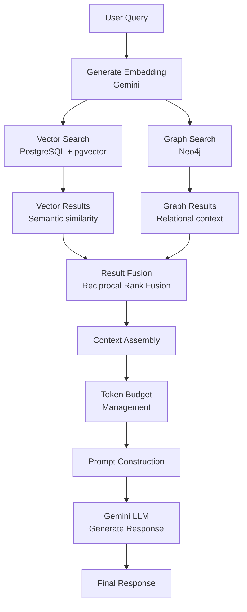

# RAG Pipeline Documentation

## Overview

NeuroGraph implements a hybrid Retrieval-Augmented Generation (RAG) pipeline that combines vector similarity search with graph traversal to provide rich, contextual information retrieval. The system leverages both semantic understanding and structural relationships for optimal context assembly.

## RAG Architecture



## Vector Embedding Process

### Embedding Generation

```python
# app/services/embedding-service.py
import google.generativeai as genai
from typing import List
import numpy as np

class EmbeddingService:
    def __init__(self, api_key: str, model: str = "models/embedding-001"):
        genai.configure(api_key=api_key)
        self.model = model
        self.dimension = 768  # Gemini embedding dimension
    
    async def generate(self, text: str) -> List[float]:
        """
        Generate embedding for text using Gemini.
        """
        result = genai.embed_content(
            model=self.model,
            content=text,
            task_type="retrieval_document"
        )
        return result['embedding']
    
    async def generate_query_embedding(self, query: str) -> List[float]:
        """
        Generate embedding for search query.
        """
        result = genai.embed_content(
            model=self.model,
            content=query,
            task_type="retrieval_query"
        )
        return result['embedding']
    
    async def generate_batch(self, texts: List[str]) -> List[List[float]]:
        """
        Generate embeddings for multiple texts.
        """
        embeddings = []
        for text in texts:
            embedding = await self.generate(text)
            embeddings.append(embedding)
        return embeddings
    
    def cosine_similarity(
        self,
        embedding1: List[float],
        embedding2: List[float]
    ) -> float:
        """
        Calculate cosine similarity between two embeddings.
        """
        vec1 = np.array(embedding1)
        vec2 = np.array(embedding2)
        
        dot_product = np.dot(vec1, vec2)
        norm1 = np.linalg.norm(vec1)
        norm2 = np.linalg.norm(vec2)
        
        if norm1 == 0 or norm2 == 0:
            return 0.0
        
        return float(dot_product / (norm1 * norm2))
```

### Embedding Storage

```python
# Store embedding with memory
async def store_memory_with_embedding(
    content: str,
    layer: str,
    user_id: str
) -> str:
    """
    Store memory with vector embedding.
    """
    # Generate embedding
    embedding = await embedding_service.generate(content)
    
    # Store in PostgreSQL
    memory_id = await postgres_service.insert_memory(
        content=content,
        embedding=embedding,
        layer=layer,
        user_id=user_id
    )
    
    return memory_id
```

## Similarity Search Algorithm

### Cosine Similarity Search

```sql
-- PostgreSQL query with pgvector
SELECT
    id,
    content,
    layer,
    confidence,
    created_at,
    1 - (embedding <=> $1::vector) as similarity_score
FROM memories
WHERE layer = ANY($2)
  AND user_id = $3
  AND 1 - (embedding <=> $1::vector) > $4  -- similarity threshold
ORDER BY embedding <=> $1::vector  -- cosine distance
LIMIT $5;
```

### Python Implementation

```python
async def vector_similarity_search(
    query: str,
    layers: List[str],
    user_id: str,
    limit: int = 20,
    similarity_threshold: float = 0.7
) -> List[Dict[str, Any]]:
    """
    Perform vector similarity search.
    """
    # Generate query embedding
    query_embedding = await embedding_service.generate_query_embedding(query)
    
    # Search PostgreSQL
    results = await postgres_service.execute(
        """
        SELECT
            id,
            content,
            layer,
            confidence,
            created_at,
            metadata,
            1 - (embedding <=> $1::vector) as similarity_score
        FROM memories
        WHERE layer = ANY($2)
          AND user_id = $3
          AND 1 - (embedding <=> $1::vector) > $4
        ORDER BY embedding <=> $1::vector
        LIMIT $5
        """,
        query_embedding,
        layers,
        user_id,
        similarity_threshold,
        limit
    )
    
    return [dict(row) for row in results]
```

### Similarity Score Interpretation

| Score Range | Interpretation | Action |
|-------------|---------------|--------|
| 0.90 - 1.00 | Very High | Include with high priority |
| 0.80 - 0.89 | High | Include with normal priority |
| 0.70 - 0.79 | Medium | Include if token budget allows |
| 0.60 - 0.69 | Low | Consider for context |
| 0.00 - 0.59 | Very Low | Exclude |

## Hybrid Search

### Graph-Enhanced Vector Search

```python
async def hybrid_search(
    query: str,
    layers: List[str],
    user_id: str,
    max_results: int = 20
) -> List[Dict[str, Any]]:
    """
    Perform hybrid search combining vector and graph.
    """
    # 1. Vector search for semantic similarity
    vector_results = await vector_similarity_search(
        query=query,
        layers=layers,
        user_id=user_id,
        limit=max_results
    )
    
    # 2. Extract entities from vector results
    entity_ids = []
    for result in vector_results:
        if 'entity_refs' in result.get('metadata', {}):
            entity_ids.extend(result['metadata']['entity_refs'])
    
    # 3. Graph traversal for related entities
    graph_results = []
    if entity_ids:
        for entity_id in entity_ids:
            # Get neighbors (depth=1)
            neighbors = await neo4j_service.get_entity_neighbors(
                entity_id=entity_id,
                depth=1,
                relationship_types=['RELATES_TO', 'MENTIONS', 'PART_OF']
            )
            graph_results.extend(neighbors)
    
    # 4. Keyword search in graph
    query_keywords = extract_keywords(query)
    for keyword in query_keywords:
        entities = await neo4j_service.find_entities_by_name(keyword)
        graph_results.extend(entities)
    
    # 5. Merge and rank results
    merged_results = merge_and_rank_results(
        vector_results=vector_results,
        graph_results=graph_results
    )
    
    return merged_results[:max_results]
```

### Reciprocal Rank Fusion

```python
def merge_and_rank_results(
    vector_results: List[Dict[str, Any]],
    graph_results: List[Dict[str, Any]],
    k: int = 60  # RRF constant
) -> List[Dict[str, Any]]:
    """
    Merge results using Reciprocal Rank Fusion.
    
    RRF(d) = Σ(1 / (k + rank(d)))
    """
    scores = {}
    
    # Score vector results
    for rank, result in enumerate(vector_results, start=1):
        doc_id = result['id']
        rrf_score = 1.0 / (k + rank)
        
        if doc_id not in scores:
            scores[doc_id] = {
                'data': result,
                'rrf_score': 0,
                'vector_rank': None,
                'graph_rank': None,
                'sources': []
            }
        
        scores[doc_id]['rrf_score'] += rrf_score
        scores[doc_id]['vector_rank'] = rank
        scores[doc_id]['sources'].append('vector')
    
    # Score graph results
    for rank, result in enumerate(graph_results, start=1):
        doc_id = result['id']
        rrf_score = 1.0 / (k + rank)
        
        if doc_id not in scores:
            scores[doc_id] = {
                'data': result,
                'rrf_score': 0,
                'vector_rank': None,
                'graph_rank': None,
                'sources': []
            }
        
        scores[doc_id]['rrf_score'] += rrf_score
        scores[doc_id]['graph_rank'] = rank
        scores[doc_id]['sources'].append('graph')
    
    # Sort by RRF score
    ranked_results = sorted(
        scores.values(),
        key=lambda x: x['rrf_score'],
        reverse=True
    )
    
    return [
        {
            **item['data'],
            'rrf_score': item['rrf_score'],
            'vector_rank': item['vector_rank'],
            'graph_rank': item['graph_rank'],
            'sources': item['sources']
        }
        for item in ranked_results
    ]
```

## Context Assembly Algorithm

### Context Builder

```python
class ContextBuilder:
    def __init__(
        self,
        max_tokens: int = 4000,
        query_tokens: int = 100
    ):
        self.max_tokens = max_tokens
        self.query_tokens = query_tokens
        self.available_tokens = max_tokens - query_tokens
    
    def build_context(
        self,
        query: str,
        search_results: List[Dict[str, Any]],
        conversation_history: List[Dict[str, str]] = None
    ) -> str:
        """
        Assemble context from search results within token budget.
        """
        context_parts = []
        token_count = 0
        
        # Add conversation history (if exists)
        if conversation_history:
            history_text = self._format_conversation_history(
                conversation_history
            )
            history_tokens = self._estimate_tokens(history_text)
            
            if token_count + history_tokens < self.available_tokens:
                context_parts.append(f"## Conversation History\n{history_text}")
                token_count += history_tokens
        
        # Add search results in priority order
        context_parts.append("## Retrieved Information\n")
        
        for i, result in enumerate(search_results, start=1):
            # Format result
            result_text = self._format_result(result, index=i)
            result_tokens = self._estimate_tokens(result_text)
            
            # Check token budget
            if token_count + result_tokens > self.available_tokens:
                # Try to add summary instead
                summary = self._summarize_result(result)
                summary_tokens = self._estimate_tokens(summary)
                
                if token_count + summary_tokens <= self.available_tokens:
                    context_parts.append(summary)
                    token_count += summary_tokens
                else:
                    break  # No more space
            else:
                context_parts.append(result_text)
                token_count += result_tokens
        
        # Assemble final context
        context = "\n\n".join(context_parts)
        
        return context
    
    def _format_result(
        self,
        result: Dict[str, Any],
        index: int
    ) -> str:
        """
        Format a search result for context.
        """
        parts = [f"### Source {index}"]
        
        # Add content
        parts.append(f"Content: {result['content']}")
        
        # Add metadata
        if 'layer' in result:
            parts.append(f"Layer: {result['layer']}")
        
        if 'confidence' in result:
            parts.append(f"Confidence: {result['confidence']:.2f}")
        
        if 'created_at' in result:
            parts.append(f"Date: {result['created_at']}")
        
        # Add relevance scores
        if 'similarity_score' in result:
            parts.append(f"Similarity: {result['similarity_score']:.2f}")
        
        if 'rrf_score' in result:
            parts.append(f"Relevance: {result['rrf_score']:.3f}")
        
        return "\n".join(parts)
    
    def _estimate_tokens(self, text: str) -> int:
        """
        Estimate token count for text.
        Rough approximation: 1 token ≈ 4 characters
        """
        return len(text) // 4
    
    def _summarize_result(self, result: Dict[str, Any]) -> str:
        """
        Create brief summary of result.
        """
        content = result['content']
        max_length = 100
        
        if len(content) > max_length:
            summary = content[:max_length] + "..."
        else:
            summary = content
        
        return f"- {summary} (confidence: {result.get('confidence', 0):.2f})"
    
    def _format_conversation_history(
        self,
        history: List[Dict[str, str]]
    ) -> str:
        """
        Format conversation history.
        """
        formatted = []
        for msg in history[-5:]:  # Last 5 messages
            role = msg['role'].capitalize()
            content = msg['content']
            formatted.append(f"{role}: {content}")
        
        return "\n".join(formatted)
```

## Token Budget Management

### Token Allocation Strategy

| Component | Token Allocation | Priority |
|-----------|-----------------|----------|
| **System Prompt** | 200 tokens | Fixed |
| **User Query** | 100 tokens | Fixed |
| **Conversation History** | 500 tokens | High |
| **Retrieved Context** | 3,000 tokens | Medium |
| **Response Generation** | 1,200 tokens | Reserved |

### Dynamic Token Management

```python
class TokenBudgetManager:
    def __init__(self, model_max_tokens: int = 8192):
        self.model_max_tokens = model_max_tokens
        self.system_prompt_tokens = 200
        self.response_tokens = 1200
        
        self.available_for_context = (
            model_max_tokens -
            self.system_prompt_tokens -
            self.response_tokens
        )
    
    def allocate_tokens(
        self,
        query_tokens: int,
        has_conversation_history: bool,
        num_search_results: int
    ) -> Dict[str, int]:
        """
        Dynamically allocate token budget.
        """
        remaining = self.available_for_context - query_tokens
        
        allocation = {
            'query': query_tokens,
            'history': 0,
            'context': 0
        }
        
        # Allocate for conversation history
        if has_conversation_history:
            history_tokens = min(500, remaining * 0.15)
            allocation['history'] = int(history_tokens)
            remaining -= allocation['history']
        
        # Remaining tokens for context
        allocation['context'] = remaining
        
        # Calculate tokens per result
        if num_search_results > 0:
            allocation['tokens_per_result'] = allocation['context'] // num_search_results
        else:
            allocation['tokens_per_result'] = 0
        
        return allocation
```

## Relevance Scoring Formula

### Multi-Factor Relevance Score

```python
def calculate_relevance_score(
    similarity_score: float,
    confidence_score: float,
    temporal_score: float,
    layer_boost: float,
    source_count: int
) -> float:
    """
    Calculate comprehensive relevance score.
    
    Factors:
    - Similarity: 40% weight (vector/graph match)
    - Confidence: 25% weight (data quality)
    - Temporal: 15% weight (recency)
    - Layer: 10% weight (context appropriateness)
    - Source: 10% weight (multi-source confirmation)
    """
    
    # Normalize source count (max benefit at 3 sources)
    source_score = min(1.0, source_count / 3.0)
    
    relevance = (
        similarity_score * 0.40 +
        confidence_score * 0.25 +
        temporal_score * 0.15 +
        layer_boost * 0.10 +
        source_score * 0.10
    )
    
    return round(relevance, 3)
```

### Layer Boost Calculation

```python
def calculate_layer_boost(
    result_layer: str,
    query_mode: str,
    global_memory: bool
) -> float:
    """
    Calculate layer-specific boost based on query context.
    """
    boost = 0.5  # Base score
    
    if query_mode == "general":
        if result_layer == "personal":
            boost = 1.0  # Perfect match
        elif result_layer == "shared" and global_memory:
            boost = 0.7  # Good match with global memory
        elif result_layer == "organization" and global_memory:
            boost = 0.6  # Acceptable match with global memory
    
    elif query_mode == "organization":
        if result_layer == "organization":
            boost = 1.0  # Perfect match
        elif result_layer == "shared":
            boost = 0.9  # Very good match
        elif result_layer == "personal" and global_memory:
            boost = 0.6  # Acceptable match with global memory
    
    return boost
```

## RAG Pipeline Implementation

### Complete RAG Flow

```python
async def rag_pipeline(
    query: str,
    user_id: str,
    mode: str,
    organization_id: str = None,
    global_memory: bool = True,
    conversation_history: List[Dict[str, str]] = None
) -> Dict[str, Any]:
    """
    Complete RAG pipeline from query to response.
    """
    # 1. Determine search layers
    layers = determine_search_layers(mode, global_memory)
    
    # 2. Hybrid search
    search_results = await hybrid_search(
        query=query,
        layers=layers,
        user_id=user_id,
        max_results=20
    )
    
    # 3. Calculate relevance scores
    scored_results = []
    for result in search_results:
        similarity = result.get('similarity_score', 0)
        confidence = result.get('confidence', 0)
        temporal = calculate_temporal_score(result['created_at'])
        layer_boost = calculate_layer_boost(result['layer'], mode, global_memory)
        source_count = len(result.get('sources', []))
        
        relevance = calculate_relevance_score(
            similarity_score=similarity,
            confidence_score=confidence,
            temporal_score=temporal,
            layer_boost=layer_boost,
            source_count=source_count
        )
        
        scored_results.append({
            **result,
            'relevance_score': relevance
        })
    
    # 4. Sort by relevance
    scored_results.sort(key=lambda x: x['relevance_score'], reverse=True)
    
    # 5. Build context within token budget
    context_builder = ContextBuilder(max_tokens=6000)
    context = context_builder.build_context(
        query=query,
        search_results=scored_results,
        conversation_history=conversation_history
    )
    
    # 6. Generate response
    response = await generate_response(
        query=query,
        context=context,
        conversation_history=conversation_history
    )
    
    return {
        'response': response,
        'sources': scored_results[:5],  # Top 5 sources
        'context_size': len(context),
        'num_sources_used': len(scored_results)
    }
```

## Prompt Construction

### System Prompt Template

```python
SYSTEM_PROMPT = """You are NeuroGraph, an AI assistant with access to a comprehensive knowledge base.

Your responsibilities:
1. Answer questions accurately based on provided context
2. Cite sources when making claims
3. Acknowledge uncertainty when information is incomplete
4. Provide clear, concise responses

Context Organization:
- Information is organized in layers: Personal, Shared, and Organization
- Each piece of information has a confidence score
- More recent information may be more relevant

Guidelines:
- Use the retrieved context to inform your responses
- When multiple sources conflict, favor higher confidence sources
- If context is insufficient, acknowledge limitations
- Be conversational but professional
"""
```

### Prompt Assembly

```python
def construct_prompt(
    query: str,
    context: str,
    conversation_history: List[Dict[str, str]] = None
) -> List[Dict[str, str]]:
    """
    Construct messages for LLM.
    """
    messages = [
        {"role": "system", "content": SYSTEM_PROMPT}
    ]
    
    # Add conversation history
    if conversation_history:
        messages.extend(conversation_history[-5:])  # Last 5 turns
    
    # Add current query with context
    user_message = f"""Context:
{context}

Query: {query}

Please provide a helpful response based on the context above."""
    
    messages.append({"role": "user", "content": user_message})
    
    return messages
```

## Performance Optimization

### Caching Strategy

```python
# Cache embeddings for frequent queries
@cache_result(ttl=3600)
async def get_or_generate_embedding(text: str) -> List[float]:
    """
    Get embedding from cache or generate new one.
    """
    return await embedding_service.generate(text)

# Cache search results
@cache_result(ttl=300)
async def cached_hybrid_search(query: str, layers: List[str]) -> List[Dict]:
    """
    Cached hybrid search results.
    """
    return await hybrid_search(query, layers)
```

### Batch Processing

```python
async def batch_embed_memories(
    memories: List[Dict[str, Any]]
) -> List[Dict[str, Any]]:
    """
    Batch process embeddings for multiple memories.
    """
    # Extract content
    contents = [m['content'] for m in memories]
    
    # Generate embeddings in batch
    embeddings = await embedding_service.generate_batch(contents)
    
    # Combine with memories
    for memory, embedding in zip(memories, embeddings):
        memory['embedding'] = embedding
    
    return memories
```

## Evaluation Metrics

### RAG Quality Metrics

| Metric | Formula | Target |
|--------|---------|--------|
| **Retrieval Precision** | Relevant results / Total retrieved | >0.8 |
| **Retrieval Recall** | Relevant retrieved / Total relevant | >0.7 |
| **Context Relevance** | Relevant context / Total context | >0.85 |
| **Answer Accuracy** | Correct answers / Total answers | >0.9 |
| **Latency** | End-to-end response time | <2s p95 |

### Monitoring

```python
class RAGMetrics:
    async def log_retrieval_metrics(
        self,
        query: str,
        results: List[Dict],
        relevant_ids: List[str]
    ):
        """
        Log retrieval performance metrics.
        """
        retrieved_ids = [r['id'] for r in results]
        
        # Precision
        relevant_retrieved = len(set(retrieved_ids) & set(relevant_ids))
        precision = relevant_retrieved / len(retrieved_ids) if retrieved_ids else 0
        
        # Recall
        recall = relevant_retrieved / len(relevant_ids) if relevant_ids else 0
        
        # F1 score
        f1 = 2 * (precision * recall) / (precision + recall) if (precision + recall) > 0 else 0
        
        # Log metrics
        await self.log({
            'query': query,
            'precision': precision,
            'recall': recall,
            'f1_score': f1,
            'num_results': len(results),
            'timestamp': datetime.utcnow()
        })
```

## Related Documentation

- [Memory](./memory.md) - Memory system used by RAG
- [Graph](./graph.md) - Graph traversal in hybrid search
- [Models](./models.md) - LLM and embedding models
- [Architecture](./architecture.md) - RAG pipeline architecture
