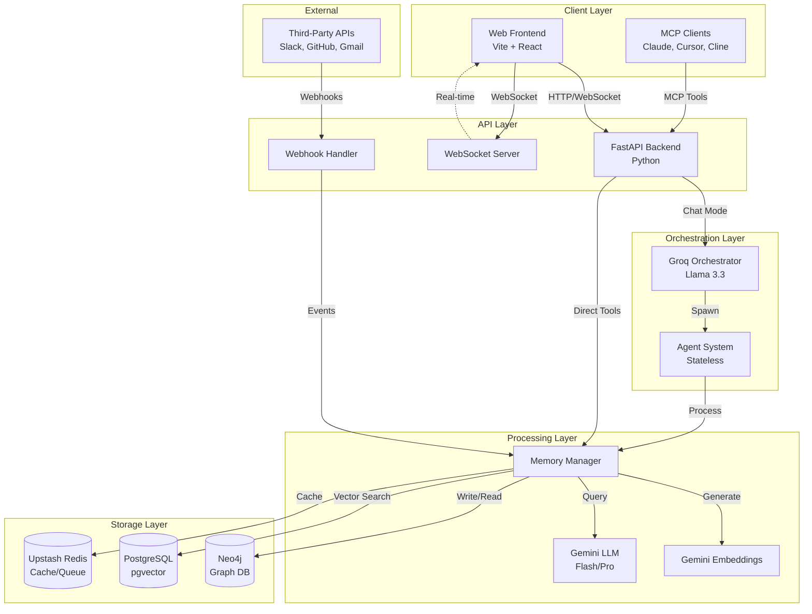

# NeuroGraph Documentation

## Overview

NeuroGraph is an advanced personal and organizational knowledge management system that combines large language models (LLMs), graph databases, and vector embeddings to create a persistent, evolving memory layer. The system enables intelligent information retrieval, relationship discovery, and context-aware interactions through multiple interfaces including a web-based chat interface and Model Context Protocol (MCP) integration.

### Core Capabilities

- **Persistent Memory**: Three-layer memory architecture (Personal, Shared, Organizational) with confidence scoring and temporal decay
- **Graph-Based Knowledge**: Neo4j graph database capturing entities, relationships, and semantic connections
- **Hybrid RAG Pipeline**: Combines vector similarity search with graph traversal for optimal context retrieval
- **Multi-Interface Access**: Web chat interface with orchestration and direct MCP tool access
- **Real-Time Updates**: WebSocket-based live graph visualization and chat updates
- **Extensible Integrations**: Webhook support for Slack, GitHub, Gmail, Discord, Notion, and Google Calendar

## Architecture Overview



## Technology Stack

| Component | Technology | Purpose |
|-----------|-----------|---------|
| **Frontend** | Vite + React | Web interface with chat and graph visualization |
| **Visualization** | D3.js | Interactive graph rendering |
| **State Management** | Zustand | Frontend state management |
| **Backend** | Python FastAPI | RESTful API and WebSocket server |
| **Orchestrator** | Groq (Llama 3.3 70B) | Intent classification and agent selection |
| **LLM** | Google Gemini Flash/Pro | Primary language model for processing |
| **Embeddings** | Gemini Embeddings | Text-to-vector conversion |
| **Graph Database** | Neo4j | Knowledge graph storage and traversal |
| **Vector Database** | PostgreSQL + pgvector | Semantic similarity search |
| **Cache/Queue** | Upstash Redis | Caching and async task queue |
| **Containerization** | Docker + Docker Compose | Infrastructure orchestration |
| **MCP Server** | Python MCP SDK | Model Context Protocol implementation |

## Quick Start

### For Developers

```bash
# Clone repository
git clone https://github.com/your-org/neurograph.git
cd neurograph

# Start infrastructure
docker-compose up -d

# Install backend dependencies
cd backend
pip install -r requirements.txt

# Configure environment
cp .env.example .env
# Edit .env with your API keys

# Run migrations
python -m alembic upgrade head

# Start backend
python main.py

# Install frontend dependencies
cd ../frontend
npm install

# Start frontend
npm run dev
```

Access the application at `http://localhost:5173`

### For MCP Client Users

1. Install the NeuroGraph MCP server:
```bash
pip install neurograph-mcp
```

2. Configure your MCP client (e.g., Claude Desktop):
```json
{
  "mcpServers": {
    "neurograph": {
      "command": "python",
      "args": ["-m", "neurograph.mcp"],
      "env": {
        "NEUROGRAPH_API_URL": "http://localhost:8000",
        "NEUROGRAPH_API_KEY": "your-api-key"
      }
    }
  }
}
```

3. Available tools: `remember`, `recall`, `search`, `add-entity`, `add-relationship`, `get-entity`, `traverse-graph`, `summarize`, `analyze-connections`, `temporal-query`

### For End Users

1. Navigate to the web interface
2. Select mode:
   - **General**: Personal memory space
   - **Organization**: Select from dropdown for shared workspace
3. Configure Global Memory toggle in settings
4. Start chatting - the system will automatically remember and recall relevant information

## Documentation Index

### Core Documentation

- [Architecture](./architecture.md) - System design, data flows, scaling strategy
- [API Reference](./api-reference.md) - REST API endpoints and schemas
- [Frontend](./frontend.md) - React application architecture and components
- [Backend](./backend.md) - FastAPI application structure and deployment

### Specialized Systems

- [Agents](./agents.md) - Agent system, orchestration, and spawning logic
- [Memory](./memory.md) - Three-layer memory architecture and isolation
- [Graph](./graph.md) - Neo4j schema, relationships, and traversal algorithms
- [Databases](./databases.md) - Setup for Neo4j, PostgreSQL, and Redis
- [RAG](./rag.md) - Retrieval-Augmented Generation pipeline
- [Models](./models.md) - LLM integration (Gemini and Groq)

### Integration Documentation

- [MCP](./mcp.md) - Model Context Protocol server and client setup
- [Webhooks](./webhooks.md) - Webhook endpoints and event processing
- [Integrations](./integrations.md) - Third-party service integrations

## Use Cases

### Personal Knowledge Management

Capture and retrieve personal information, notes, and insights. The system automatically extracts entities, creates relationships, and builds a personal knowledge graph accessible through natural language queries.

**Example**: "What were the key points from my meeting with Sarah last week?"

### Team Collaboration

Share organizational memory across team members. Insights, decisions, and context are stored in the shared layer, enabling seamless knowledge transfer and onboarding.

**Example**: "What's our current position on the migration to microservices?"

### Research and Analysis

Automatically process documents, emails, and messages to build a comprehensive knowledge base. Discover hidden connections and patterns through graph traversal.

**Example**: "Show me all the research related to machine learning that references our Q3 roadmap."

### Automated Context

Integrate with AI assistants (Claude, Cursor, Cline) via MCP to provide persistent context across sessions without manual prompting.

**Example**: MCP-enabled Claude automatically accesses project context when answering technical questions.

### Event-Driven Knowledge

Process webhooks from Slack, GitHub, Gmail to automatically capture and structure information from external sources.

**Example**: GitHub pull requests and discussions are automatically added to the knowledge graph.

## System Requirements

### Minimum Hardware

- **CPU**: 4 cores
- **RAM**: 8 GB
- **Storage**: 20 GB SSD

### Recommended Hardware

- **CPU**: 8+ cores
- **RAM**: 16+ GB
- **Storage**: 50+ GB SSD

### Software Requirements

- Docker 24.0+
- Docker Compose 2.20+
- Python 3.11+
- Node.js 20+
- Modern web browser (Chrome, Firefox, Edge, Safari)

## Support and Contributing

### Getting Help

- [GitHub Issues](https://github.com/your-org/neurograph/issues) - Bug reports and feature requests
- [Documentation](./readme.md) - Comprehensive technical documentation
- [Discussions](https://github.com/your-org/neurograph/discussions) - Community support

### Contributing

Contributions are welcome. Please review the contribution guidelines and submit pull requests to the main repository.

## License

See LICENSE file for details.

## Acknowledgments

Built with modern AI technologies including Google Gemini, Groq, Neo4j, and the Model Context Protocol.
