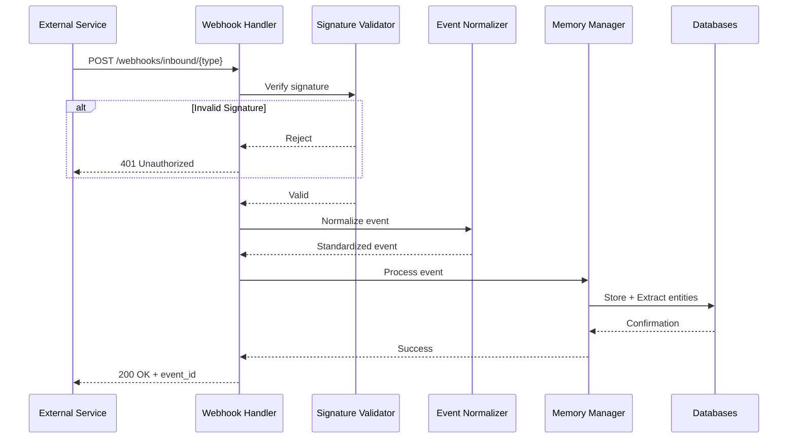

# Webhook Integration Documentation

## Overview

NeuroGraph processes incoming webhooks from external services to automatically capture and structure information in the knowledge graph. Webhooks bypass the orchestrator entirely, providing direct, deterministic processing of external events.

## Webhook Architecture



## Webhook Endpoints

### Endpoint Table

| Integration | Endpoint | Method | Authentication |
|-------------|----------|--------|----------------|
| **Slack** | `/webhooks/inbound/slack` | POST | HMAC-SHA256 |
| **GitHub** | `/webhooks/inbound/github` | POST | HMAC-SHA256 |
| **Gmail** | `/webhooks/inbound/gmail` | POST | OAuth2 + HMAC |
| **Discord** | `/webhooks/inbound/discord` | POST | Signature |
| **Notion** | `/webhooks/inbound/notion` | POST | Bearer Token |
| **Google Calendar** | `/webhooks/inbound/google-calendar` | POST | OAuth2 + HMAC |

### Generic Webhook Endpoint

```python
# app/api/routes/webhooks.py
from fastapi import APIRouter, Request, HTTPException, Header
from typing import Optional

router = APIRouter()

@router.post("/inbound/{integration_type}")
async def handle_webhook(
    integration_type: str,
    request: Request,
    x_signature: Optional[str] = Header(None),
    x_integration_id: Optional[str] = Header(None)
):
    """
    Generic webhook handler for external integrations.
    """
    # Get raw body for signature verification
    body = await request.body()
    
    # Verify signature
    if not await verify_webhook_signature(
        integration_type=integration_type,
        body=body,
        signature=x_signature,
        integration_id=x_integration_id
    ):
        raise HTTPException(status_code=401, detail="Invalid signature")
    
    # Parse body
    try:
        event_data = await request.json()
    except Exception as e:
        raise HTTPException(status_code=400, detail=f"Invalid JSON: {str(e)}")
    
    # Process webhook
    result = await process_webhook(
        integration_type=integration_type,
        event_data=event_data
    )
    
    return {
        "status": "accepted",
        "event_id": result["event_id"],
        "processed": True
    }
```

## Event Normalization Process

### Normalizer Architecture

```python
# app/webhooks/normalizers/base.py
from abc import ABC, abstractmethod
from typing import Dict, Any

class BaseNormalizer(ABC):
    """
    Base class for event normalizers.
    """
    
    @abstractmethod
    async def normalize(self, event_data: Dict[str, Any]) -> Dict[str, Any]:
        """
        Normalize event data to standard format.
        
        Returns:
        {
            "event_type": "message|issue|commit|event",
            "content": "Extracted text content",
            "layer": "personal|shared|organization",
            "entities": [
                {"name": "...", "type": "...", "properties": {...}}
            ],
            "metadata": {
                "source": "slack|github|gmail",
                "timestamp": "ISO 8601 datetime",
                "user": "user_id or email",
                "channel": "channel_id or repo",
                ...
            }
        }
        """
        pass
    
    def extract_user(self, event_data: Dict[str, Any]) -> Optional[str]:
        """
        Extract user identifier from event.
        """
        pass
    
    def extract_content(self, event_data: Dict[str, Any]) -> str:
        """
        Extract text content from event.
        """
        pass
```

### Slack Normalizer

```python
# app/webhooks/normalizers/slack.py
class SlackNormalizer(BaseNormalizer):
    """
    Normalize Slack webhook events.
    """
    
    async def normalize(self, event_data: Dict[str, Any]) -> Dict[str, Any]:
        event = event_data.get("event", {})
        event_type = event.get("type")
        
        if event_type == "message":
            return await self._normalize_message(event)
        elif event_type == "reaction_added":
            return await self._normalize_reaction(event)
        else:
            raise ValueError(f"Unsupported Slack event type: {event_type}")
    
    async def _normalize_message(self, event: Dict[str, Any]) -> Dict[str, Any]:
        return {
            "event_type": "message",
            "content": event.get("text", ""),
            "layer": "shared",  # Slack is team-based
            "entities": [
                {
                    "name": event.get("channel"),
                    "type": "channel",
                    "properties": {
                        "platform": "slack"
                    }
                },
                {
                    "name": event.get("user"),
                    "type": "person",
                    "properties": {
                        "slack_id": event.get("user")
                    }
                }
            ],
            "metadata": {
                "source": "slack",
                "timestamp": event.get("ts"),
                "user": event.get("user"),
                "channel": event.get("channel"),
                "thread_ts": event.get("thread_ts")
            }
        }
```

### GitHub Normalizer

```python
# app/webhooks/normalizers/github.py
class GitHubNormalizer(BaseNormalizer):
    """
    Normalize GitHub webhook events.
    """
    
    async def normalize(self, event_data: Dict[str, Any]) -> Dict[str, Any]:
        action = event_data.get("action")
        
        if "issue" in event_data:
            return await self._normalize_issue(event_data)
        elif "pull_request" in event_data:
            return await self._normalize_pull_request(event_data)
        elif "commits" in event_data:
            return await self._normalize_push(event_data)
        else:
            raise ValueError("Unsupported GitHub event type")
    
    async def _normalize_issue(self, event_data: Dict[str, Any]) -> Dict[str, Any]:
        issue = event_data["issue"]
        
        return {
            "event_type": "issue",
            "content": f"Issue: {issue['title']}\n\n{issue['body']}",
            "layer": "shared",
            "entities": [
                {
                    "name": issue["title"],
                    "type": "issue",
                    "properties": {
                        "number": issue["number"],
                        "state": issue["state"],
                        "labels": [l["name"] for l in issue.get("labels", [])]
                    }
                },
                {
                    "name": event_data["repository"]["full_name"],
                    "type": "repository",
                    "properties": {
                        "platform": "github"
                    }
                }
            ],
            "metadata": {
                "source": "github",
                "timestamp": issue["created_at"],
                "user": issue["user"]["login"],
                "repository": event_data["repository"]["full_name"],
                "url": issue["html_url"]
            }
        }
    
    async def _normalize_pull_request(
        self,
        event_data: Dict[str, Any]
    ) -> Dict[str, Any]:
        pr = event_data["pull_request"]
        
        return {
            "event_type": "pull_request",
            "content": f"PR: {pr['title']}\n\n{pr['body']}",
            "layer": "shared",
            "entities": [
                {
                    "name": pr["title"],
                    "type": "pull_request",
                    "properties": {
                        "number": pr["number"],
                        "state": pr["state"],
                        "merged": pr.get("merged", False)
                    }
                }
            ],
            "metadata": {
                "source": "github",
                "timestamp": pr["created_at"],
                "user": pr["user"]["login"],
                "repository": event_data["repository"]["full_name"],
                "url": pr["html_url"]
            }
        }
```

### Gmail Normalizer

```python
# app/webhooks/normalizers/gmail.py
class GmailNormalizer(BaseNormalizer):
    """
    Normalize Gmail webhook events (Gmail Push Notifications).
    """
    
    async def normalize(self, event_data: Dict[str, Any]) -> Dict[str, Any]:
        # Gmail sends minimal data, need to fetch full message
        message_id = event_data.get("message", {}).get("data")
        
        # Fetch full message from Gmail API
        message = await self._fetch_message(message_id)
        
        return {
            "event_type": "email",
            "content": self._extract_email_content(message),
            "layer": "personal",  # Email is typically personal
            "entities": [
                {
                    "name": message["from"],
                    "type": "person",
                    "properties": {
                        "email": message["from"]
                    }
                },
                {
                    "name": message["subject"],
                    "type": "email",
                    "properties": {
                        "thread_id": message.get("thread_id")
                    }
                }
            ],
            "metadata": {
                "source": "gmail",
                "timestamp": message["date"],
                "from": message["from"],
                "to": message["to"],
                "subject": message["subject"],
                "labels": message.get("labels", [])
            }
        }
    
    def _extract_email_content(self, message: Dict[str, Any]) -> str:
        """
        Extract text content from email message.
        """
        subject = message.get("subject", "")
        body = message.get("body", "")
        
        return f"Subject: {subject}\n\n{body}"
```

## Signature Verification

### HMAC-SHA256 Verification

```python
# app/webhooks/validators.py
import hmac
import hashlib
from typing import Optional

class WebhookValidator:
    def __init__(self, secrets: Dict[str, str]):
        self.secrets = secrets
    
    def verify_slack(
        self,
        body: bytes,
        timestamp: str,
        signature: str
    ) -> bool:
        """
        Verify Slack webhook signature.
        """
        secret = self.secrets.get("slack")
        if not secret:
            return False
        
        # Slack signature format: v0=<hash>
        sig_basestring = f"v0:{timestamp}:{body.decode('utf-8')}"
        
        expected_signature = 'v0=' + hmac.new(
            secret.encode(),
            sig_basestring.encode(),
            hashlib.sha256
        ).hexdigest()
        
        return hmac.compare_digest(expected_signature, signature)
    
    def verify_github(
        self,
        body: bytes,
        signature: str
    ) -> bool:
        """
        Verify GitHub webhook signature.
        """
        secret = self.secrets.get("github")
        if not secret:
            return False
        
        # GitHub signature format: sha256=<hash>
        expected_signature = 'sha256=' + hmac.new(
            secret.encode(),
            body,
            hashlib.sha256
        ).hexdigest()
        
        return hmac.compare_digest(expected_signature, signature)
    
    def verify_generic(
        self,
        body: bytes,
        signature: str,
        secret: str
    ) -> bool:
        """
        Generic HMAC-SHA256 verification.
        """
        expected_signature = hmac.new(
            secret.encode(),
            body,
            hashlib.sha256
        ).hexdigest()
        
        # Handle both with and without "sha256=" prefix
        signature_hash = signature.replace("sha256=", "")
        
        return hmac.compare_digest(expected_signature, signature_hash)
```

## Retry Logic

### Exponential Backoff

```python
# app/webhooks/handler.py
import asyncio
from datetime import datetime, timedelta

class WebhookProcessor:
    def __init__(self, max_retries: int = 10):
        self.max_retries = max_retries
        self.retry_delays = [
            60,      # 1 minute
            300,     # 5 minutes
            900,     # 15 minutes
            3600,    # 1 hour
            7200,    # 2 hours
            14400,   # 4 hours
            28800,   # 8 hours
            43200,   # 12 hours
            86400,   # 24 hours
            86400,   # 24 hours (final)
        ]
    
    async def process_with_retry(
        self,
        event_id: str,
        event_data: Dict[str, Any]
    ):
        """
        Process webhook with automatic retry on failure.
        """
        for attempt in range(self.max_retries):
            try:
                result = await self._process_event(event_data)
                await self._mark_success(event_id)
                return result
            except Exception as e:
                logger.error(f"Webhook processing failed (attempt {attempt + 1}): {e}")
                
                if attempt < self.max_retries - 1:
                    # Schedule retry
                    delay = self.retry_delays[attempt]
                    retry_at = datetime.utcnow() + timedelta(seconds=delay)
                    
                    await self._schedule_retry(
                        event_id=event_id,
                        retry_at=retry_at,
                        attempt=attempt + 1
                    )
                else:
                    # Max retries reached
                    await self._mark_failed(event_id, str(e))
                    raise
```

## Event Schema

### Standardized Event Format

```json
{
  "event_id": "evt_123abc",
  "event_type": "message|issue|commit|email|event",
  "source": "slack|github|gmail|discord|notion|google-calendar",
  "content": "Extracted text content",
  "layer": "personal|shared|organization",
  "user_id": "user_123",
  "organization_id": "org_123",
  "entities": [
    {
      "name": "Entity Name",
      "type": "person|project|document|event|channel",
      "properties": {
        "key": "value"
      }
    }
  ],
  "metadata": {
    "timestamp": "2024-01-15T10:30:00Z",
    "source_id": "channel_123",
    "url": "https://...",
    "custom_field": "value"
  },
  "processed_at": "2024-01-15T10:30:02Z",
  "processing_time_ms": 245
}
```

## Integration Examples

### Slack Integration

```python
# Setup Slack webhook
# 1. Create Slack App: https://api.slack.com/apps
# 2. Enable Event Subscriptions
# 3. Set Request URL: https://your-domain.com/webhooks/inbound/slack
# 4. Subscribe to events: message.channels, message.groups
# 5. Save signing secret

# Example Slack event
slack_event = {
    "token": "...",
    "team_id": "T123ABC",
    "event": {
        "type": "message",
        "user": "U123ABC",
        "text": "Let's discuss the Q1 roadmap tomorrow",
        "channel": "C123ABC",
        "ts": "1640995200.000100"
    }
}
```

### GitHub Integration

```python
# Setup GitHub webhook
# 1. Go to repository Settings > Webhooks
# 2. Set Payload URL: https://your-domain.com/webhooks/inbound/github
# 3. Content type: application/json
# 4. Select events: Issues, Pull requests, Pushes
# 5. Save webhook secret

# Example GitHub event
github_event = {
    "action": "opened",
    "issue": {
        "number": 42,
        "title": "Add new feature",
        "body": "Description of the feature...",
        "user": {"login": "johndoe"},
        "state": "open"
    },
    "repository": {
        "full_name": "acme/project"
    }
}
```

### Gmail Integration

```python
# Setup Gmail webhook (Gmail Push Notifications)
# 1. Enable Gmail API
# 2. Set up OAuth2 credentials
# 3. Subscribe to Gmail push notifications
# 4. Set push endpoint: https://your-domain.com/webhooks/inbound/gmail

# Gmail sends minimal notification
gmail_notification = {
    "message": {
        "data": "base64_encoded_message_id",
        "messageId": "msg_123",
        "publishTime": "2024-01-15T10:30:00Z"
    }
}

# Fetch full message using Gmail API
from google.oauth2.credentials import Credentials
from googleapiclient.discovery import build

async def fetch_gmail_message(message_id: str, credentials: Credentials):
    service = build('gmail', 'v1', credentials=credentials)
    message = service.users().messages().get(
        userId='me',
        id=message_id,
        format='full'
    ).execute()
    
    return message
```

### Discord Integration

```python
# Setup Discord webhook
# 1. Create Discord Application
# 2. Add bot to server
# 3. Configure webhook URL: https://your-domain.com/webhooks/inbound/discord

# Example Discord event
discord_event = {
    "type": 0,  # MESSAGE_CREATE
    "content": "Planning meeting notes",
    "channel_id": "123456789",
    "author": {
        "id": "987654321",
        "username": "john_doe"
    },
    "timestamp": "2024-01-15T10:30:00Z"
}
```

### Notion Integration

```python
# Setup Notion webhook
# 1. Create Notion integration
# 2. Subscribe to page/database events
# 3. Set webhook URL: https://your-domain.com/webhooks/inbound/notion

# Example Notion event
notion_event = {
    "type": "page",
    "action": "created",
    "page": {
        "id": "page_123",
        "properties": {
            "title": "Project Planning Doc"
        }
    },
    "workspace": {
        "id": "workspace_123"
    }
}
```

### Google Calendar Integration

```python
# Setup Google Calendar webhook
# 1. Enable Google Calendar API
# 2. Set up OAuth2
# 3. Watch calendar for changes
# 4. Set notification endpoint

# Example Google Calendar event
calendar_event = {
    "kind": "calendar#event",
    "id": "event_123",
    "summary": "Q1 Planning Meeting",
    "start": {
        "dateTime": "2024-01-15T14:00:00Z"
    },
    "end": {
        "dateTime": "2024-01-15T15:30:00Z"
    },
    "attendees": [
        {"email": "john@example.com"},
        {"email": "sarah@example.com"}
    ]
}
```

## Event Storage

### Webhook Event Table

```sql
CREATE TABLE webhook_events (
    id UUID PRIMARY KEY DEFAULT uuid_generate_v4(),
    event_id VARCHAR(255) UNIQUE NOT NULL,
    integration_type VARCHAR(50) NOT NULL,
    event_type VARCHAR(50) NOT NULL,
    raw_data JSONB NOT NULL,
    normalized_data JSONB,
    status VARCHAR(50) DEFAULT 'pending',
    retry_count INTEGER DEFAULT 0,
    next_retry_at TIMESTAMP,
    processed_at TIMESTAMP,
    error_message TEXT,
    created_at TIMESTAMP DEFAULT CURRENT_TIMESTAMP
);

CREATE INDEX idx_webhook_events_status ON webhook_events(status);
CREATE INDEX idx_webhook_events_integration ON webhook_events(integration_type);
CREATE INDEX idx_webhook_events_retry ON webhook_events(next_retry_at) WHERE status = 'pending';
```

## Monitoring and Logging

### Webhook Metrics

```python
class WebhookMetrics:
    async def log_webhook_received(
        self,
        integration_type: str,
        event_type: str
    ):
        """
        Log webhook receipt.
        """
        await metrics.increment(
            "webhook.received",
            tags={
                "integration": integration_type,
                "event_type": event_type
            }
        )
    
    async def log_webhook_processed(
        self,
        integration_type: str,
        processing_time_ms: int,
        success: bool
    ):
        """
        Log webhook processing result.
        """
        await metrics.histogram(
            "webhook.processing_time",
            processing_time_ms,
            tags={"integration": integration_type}
        )
        
        await metrics.increment(
            "webhook.processed",
            tags={
                "integration": integration_type,
                "success": str(success)
            }
        )
```

## Security Best Practices

1. **Always verify signatures**: Never process webhooks without signature verification
2. **Use HTTPS**: All webhook endpoints must use TLS
3. **Validate payload**: Check for required fields and valid data types
4. **Rate limiting**: Implement rate limits per integration
5. **Idempotency**: Handle duplicate events gracefully
6. **Secret rotation**: Rotate webhook secrets regularly
7. **Audit logging**: Log all webhook events for security review

## Related Documentation

- [Integrations](./integrations.md) - Detailed integration setup
- [Architecture](./architecture.md) - Webhook data flow
- [Backend](./backend.md) - Webhook handler implementation
- [Memory](./memory.md) - Memory storage from webhooks
